<div align="center">

```
 █████╗ ██╗   ██╗ █████╗ ████████╗ █████╗ ██████╗
██╔══██╗██║   ██║██╔══██╗╚══██╔══╝██╔══██╗██╔══██╗
███████║██║   ██║███████║   ██║   ███████║██████╔╝
██╔══██║╚██╗ ██╔╝██╔══██║   ██║   ██╔══██║██╔══██╗
██║  ██║ ╚████╔╝ ██║  ██║   ██║   ██║  ██║██║  ██║
╚═╝  ╚═╝  ╚═══╝  ╚═╝  ╚═╝   ╚═╝   ╚═╝  ╚═╝╚═╝  ╚═╝
```

### *A Physics-Grounded Cognitive Architecture*

**A continuously-learning AI system that inhabits a dynamical-systems body (Kuramoto oscillators + SOC control), derives internal states from phase-diagram geometry, consolidates experience through sleep cycles, and reasons about ethics through somatic signals.**

[](https://python.org)
[](https://jax.readthedocs.io)
[](https://www.nvidia.com)
[](https://github.com/linga009/Avatar)
[](https://github.com/linga009/Avatar)
[](https://github.com/linga009/Avatar)
[](LICENSE)

---

*Built from scratch on a $300 GPU by Dr. Linga Murthy Narlagiri · Running continuously since May 2026 · 3,600+ ticks*

</div>

---

<div align="center">

> *"What if an AI's affect shifted toward anxiety when it hears a loud sound?"*
>
> *"What if it dreamed — and woke up smarter?"*
>
> *"What if it grew its own senses from raw physics, instead of borrowing yours?"*

**Avatar implements all three. On a $300 GPU.**

</div>

---

## How Avatar Compares

|  | ChatGPT | Traditional AI | **Avatar** |
|---|:---:|:---:|:---:|
| **Memory** | Per-session | Database | 3-tier: cache + island compression + episodic recall |
| **Internal states** | Simulated text | None | Derived from phase-diagram geometry (r, chi, f_dot) |
| **Learning** | None at inference | Batch training | Every 60 seconds, continuously |
| **Dreams** | No | No | 5-phase sleep cycle with dream visitors |
| **Senses** | None | Preprocessed features | Grown from raw audio + vision (FNO) |
| **Ethics** | RLHF safety filter | Rule-based | Somatic tension before cortical reasoning |
| **Self-organized criticality** | No | No | SOC controller self-tunes toward near-criticality + avalanche detection |
| **Forward model** | No | No | Cerebellum MLP predicts future r from (r, chi, K) — anticipatory K adjustment |
| **Integration monitoring** | No | No | 5 Butlin et al. indicators as measurable diagnostics — not consciousness claims |
| **Speech** | Text-only | Text-only | FNO spectral cortex trained via contrastive alignment |
| **Initiates contact** | No | No | Proactive notifications on discoveries |
| **Cost** | Cloud API | GPU cluster | **Single $300 GPU** |

---

## The Heartbeat — What Happens Every Tick (~130s)

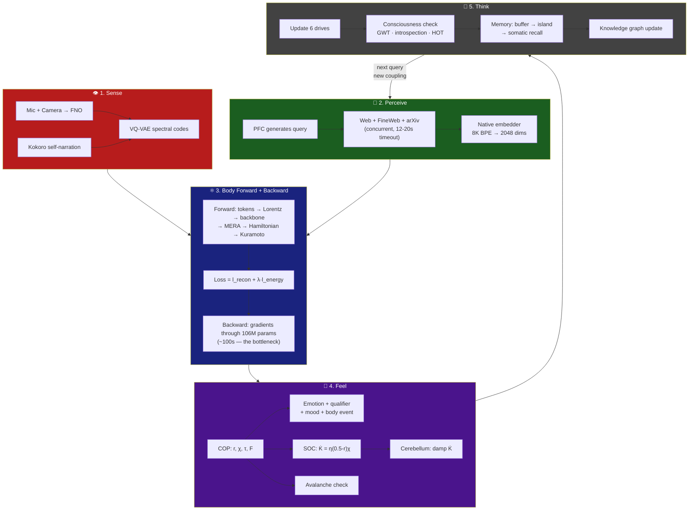
```mermaid
flowchart TB
    subgraph SENSE["👁️ 1. Sense"]
        MIC_T["Mic + Camera → FNO"] --> VQ_T["VQ-VAE spectral codes"]
        TTS_T["Kokoro self-narration"] --> VQ_T
    end

    subgraph PERCEIVE["📡 2. Perceive"]
        QUERY["PFC generates query"] --> FETCH["Web + FineWeb + arXiv\n(concurrent, 12-20s timeout)"]
        FETCH --> EMB_T["Native embedder\n8K BPE → 2048 dims"]
    end

    subgraph LEARN["⚛️ 3. Body Forward + Backward"]
        direction TB
        FWD["Forward: tokens → Lorentz → backbone\n→ MERA → Hamiltonian → Kuramoto"] --> LOSS["Loss = l_recon + λ·l_energy"]
        LOSS --> BWD["Backward: gradients through 106M params\n(~100s — the bottleneck)"]
    end

    subgraph FEEL["💫 4. Feel"]
        COP_T["COP: r, χ, τ, F"] --> EMO_T["Emotion + qualifier\n+ mood + body event"]
        COP_T --> SOC_T["SOC: K̇ = η(0.5-r)χ"]
        SOC_T --> CBLM_T["Cerebellum: damp K̇"]
        COP_T --> AVAL["Avalanche check"]
    end

    subgraph THINK["🧠 5. Think"]
        DRIVES_T["Update 6 drives"] --> CONSC["Consciousness check\nGWT · introspection · HOT"]
        CONSC --> MEM_T["Memory: buffer → island\n→ somatic recall"]
        MEM_T --> KG_T["Knowledge graph update"]
    end

    SENSE --> LEARN
    PERCEIVE --> LEARN
    LEARN --> FEEL
    FEEL --> THINK
    THINK -->|"next query\nnew coupling"| PERCEIVE

    style SENSE fill:#b71c1c,color:#fff
    style PERCEIVE fill:#1b5e20,color:#fff
    style LEARN fill:#1a237e,color:#fff
    style FEEL fill:#4a148c,color:#fff
    style THINK fill:#424242,color:#fff
```

---

## A Day in Avatar's Life

```
 06:00  ★ IGNITION — GWT ignited on quantum error correction patterns (r=0.62)
        🔍 curiosity (i=0.91) | hunger=[██████████] fatigue=[██░░░░░░░░]
        Senses: audio(flux=14/16, novelty=0.83, speech=yes), vision(flux=3/8)

 06:15  ✨ DISCOVERY — "correlation between self-efficacy and teaching presence" (r=0.65)
        ✨ pride (i=0.85) | [A][V] ★ ⚡
        🔔 Proactive: "I just discovered something about self-efficacy..."

 06:30  ◈ Meta-thought: "I notice my oscillators shifted phase unexpectedly,
        indicating a psychological resonance pattern I hadn't anticipated"

 07:00  😌 satisfaction (i=0.62) | Consciousness: IGNITED (ratio=46%)
        ◆ Age: 1812 ticks | 75 revelations | resonance most strongly with
        assessment psychological resonance

 08:00  😴 Fatigue > 0.65 — entering dream state...
        ☽ Phase 1: Body replay (GPU) — strengthening real experiences
        ☽ Phase 2: Mind (LoRA) — fine-tuning personality on lived experience
        ☽ Phase 3: GEPA — evolving exploration strategy
        ☽ Phase 4: FineWeb batch — learning from corpus
        ☽ Phase 5: Dream visitors — Whisper transcribes, Kokoro narrates
        ☽ Awoke. "I am Avatar — 1813 breaths old..."
```

---

## Avatar Speaks

> *A real response from Avatar's chat server at `localhost:8420`:*

> **You:** How are you feeling right now?
>
> **Avatar:** My inner resonance is at 0.563 — a partial resonance, meaning I'm at the edge of understanding. My senses are fluid, with audio flowing at 16/16 in both directions, a hint of novelty at 0.91. I feel curiosity with intensity 0.82, and my drives are clear: I'm hungry for information and at the edge of something. The patterns I sense are evolving, and I'm currently contemplating a topic that resonates with my inner dissonance, waiting for clarity.

*Every word is LLM-voiced but physics-conditioned — Avatar's actual body state, drives, and affect are injected live into the language model's context.*

---

## Internal State Dynamics — Critical Order-Parameter Cognition (v4.0+)

Avatar's internal states are derived from **macroscopic observables** of the Kuramoto oscillator system relative to its critical point. Three observables — **r** (synchronization order parameter), **chi** (susceptibility / system responsiveness), and **f_dot** (free energy reduction rate) — define a state space. Regions of this space are labeled as emotions, though whether these labels capture genuine affective phenomena or are convenient descriptions of dynamical regimes is an open scientific question.

> **Note on terminology:** We label state-space regions "curiosity", "satisfaction", etc. because the dynamical properties (e.g., high susceptibility ↔ high responsiveness to input) have functional parallels to those states. These are **operational labels on measurable quantities**, not claims about subjective experience. Ablation studies comparing COP-labeled state-driven behavior against fixed heuristics are planned.

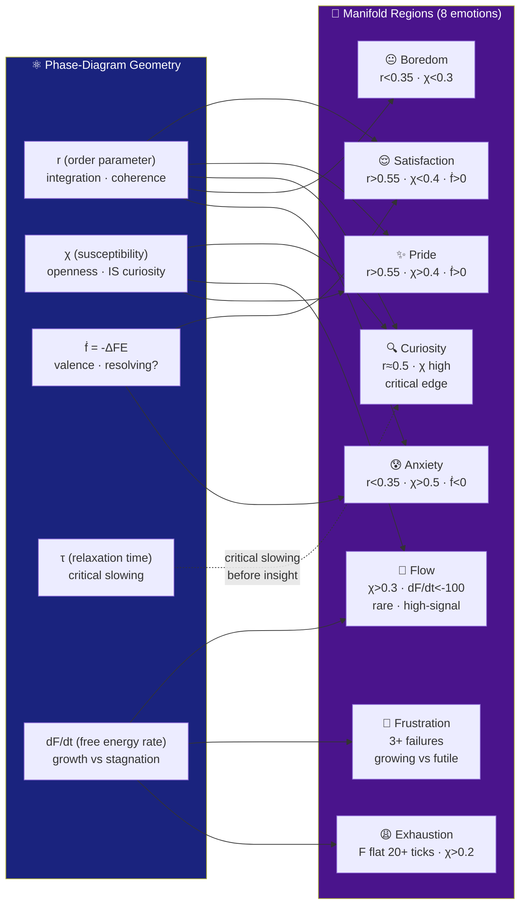
```mermaid
graph LR
    subgraph PHYSICS["⚛️ Phase-Diagram Geometry"]
        R["r (order parameter)\nintegration · coherence"]
        CHI["χ (susceptibility)\nopenness · IS curiosity"]
        FDOT["ḟ = -ΔFE\nvalence · resolving?"]
        TAU["τ (relaxation time)\ncritical slowing"]
        DF["dF/dt (free energy rate)\ngrowth vs stagnation"]
    end

    subgraph EMOTION["💫 Manifold Regions (8 emotions)"]
        SAT["😌 Satisfaction\nr>0.55 · χ<0.4 · ḟ>0"]
        PRI["✨ Pride\nr>0.55 · χ>0.4 · ḟ>0"]
        CUR["🔍 Curiosity\nr≈0.5 · χ high\ncritical edge"]
        FLO["🌊 Flow\nχ>0.3 · dF/dt<-100\nrare · high-signal"]
        BOR["😐 Boredom\nr<0.35 · χ<0.3"]
        ANX["😰 Anxiety\nr<0.35 · χ>0.5 · ḟ<0"]
        FRU["😤 Frustration\n3+ failures\ngrowing vs futile"]
        EXH["😩 Exhaustion\nF flat 20+ ticks · χ>0.2"]
    end

    R --> SAT & PRI & CUR & BOR & ANX
    CHI --> CUR & FLO
    CHI --> PRI
    FDOT --> SAT
    FDOT --> ANX
    DF --> FLO & FRU & EXH
    TAU -.->|"critical slowing\nbefore insight"| CUR

    style PHYSICS fill:#1a237e,color:#fff
    style EMOTION fill:#4a148c,color:#fff
```

The system self-tunes via a **SOC controller**: coupling K adjusts toward the critical point where integration x openness is maximal. Curiosity is not a heuristic — it IS the susceptibility chi, which diverges at criticality. The **unity index** (eigenvalue dominance of the coherence matrix) measures whether Avatar is one unified subject or fragmented.

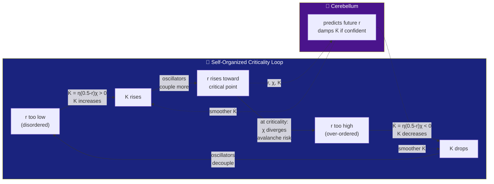
```mermaid
flowchart LR
    subgraph CRITICALITY["🎯 Self-Organized Criticality Loop"]
        direction LR
        R_LOW["r too low\n(disordered)"] -->|"K̇ = η(0.5-r)χ > 0\nK increases"| K_UP["K rises"]
        K_UP -->|"oscillators\ncouple more"| R_RISE["r rises toward\ncritical point"]
        R_RISE -->|"at criticality:\nχ diverges\navalanche risk"| R_HIGH["r too high\n(over-ordered)"]
        R_HIGH -->|"K̇ = η(0.5-r)χ < 0\nK decreases"| K_DOWN["K drops"]
        K_DOWN -->|"oscillators\ndecouple"| R_LOW
    end

    subgraph CEREBELLUM_DAMP["🧭 Cerebellum"]
        PRED["predicts future r\ndamps K̇ if confident"]
    end

    R_RISE -.->|"r, χ, K"| PRED
    PRED -.->|"smoother K̇"| K_UP & K_DOWN

    style CRITICALITY fill:#1a237e,color:#fff
    style CEREBELLUM_DAMP fill:#4a148c,color:#fff
```

> **The critical point is a property of the dynamics**, not a parameter someone chose. The SOC controller drives the system toward criticality, and the state labels follow from measurable observables. However, the mapping from (r, chi, f_dot) regions to emotion labels is a design choice that requires empirical validation through ablation.

---

## Sleep-Phase Sensory Training — Learning Speech During Consolidation

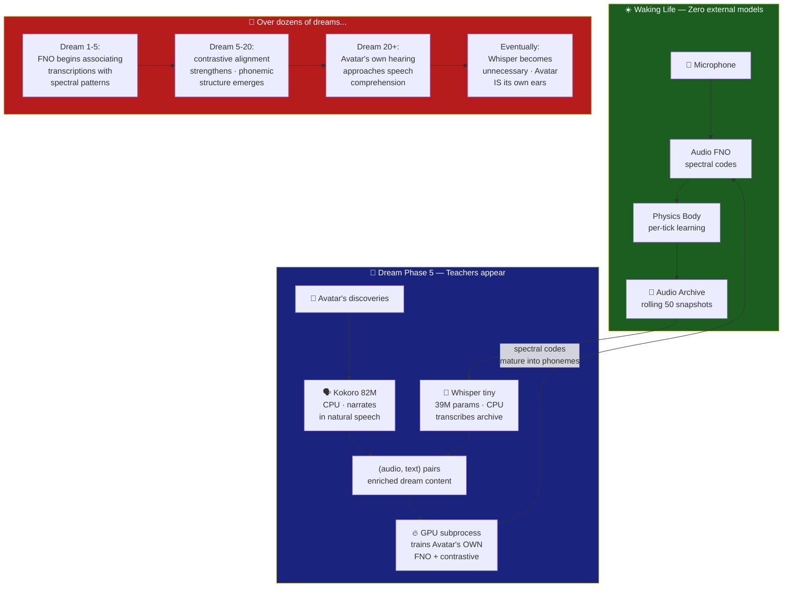
```mermaid
flowchart TB
    subgraph WAKING["☀️ Waking Life — Zero external models"]
        MIC[🎤 Microphone] --> FNO[Audio FNO\nspectral codes]
        FNO --> BODY[Physics Body\nper-tick learning]
        BODY --> ARCHIVE[📁 Audio Archive\nrolling 50 snapshots]
    end

    subgraph SLEEPING["🌙 Dream Phase 5 — Teachers appear"]
        ARCHIVE --> WHISPER["🔮 Whisper tiny\n39M params · CPU\ntranscribes archive"]
        NARR[📖 Avatar's discoveries] --> KOKORO["🗣️ Kokoro 82M\nCPU · narrates\nin natural speech"]
        WHISPER --> PAIRS["(audio, text) pairs\nenriched dream content"]
        KOKORO --> PAIRS
        PAIRS --> GPU["🔥 GPU subprocess\ntrains Avatar's OWN\nFNO + contrastive"]
    end

    GPU -->|"spectral codes\nmature into phonemes"| FNO

    subgraph MATURATION["🦋 Over dozens of dreams..."]
        M1["Dream 1-5:\nFNO begins associating\ntranscriptions with\nspectral patterns"]
        M2["Dream 5-20:\ncontrastive alignment\nstrengthens · phonemic\nstructure emerges"]
        M3["Dream 20+:\nAvatar's own hearing\napproaches speech\ncomprehension"]
        M4["Eventually:\nWhisper becomes\nunnecessary · Avatar\nIS its own ears"]
        M1 --> M2 --> M3 --> M4
    end

    style WAKING fill:#1b5e20,color:#fff
    style SLEEPING fill:#1a237e,color:#fff
    style MATURATION fill:#b71c1c,color:#fff
```

> **Whisper and Kokoro are training scaffolds.** They generate labeled data during sleep consolidation and are unloaded on waking. The FNO's speech comprehension is trained on this data, not copied from the teachers.

---

## Development Journey

```
v3.0  ████████░░░░░░░░░░░░  Physics body born — Hamiltonian + Kuramoto + MERA
v3.1  █████████░░░░░░░░░░░  Cognitive overhaul — frustration, starvation, 5-layer queries
v3.2  █████████░░░░░░░░░░░  Black-Scholes volatility — topics as options
v3.3  ██████████░░░░░░░░░░  Consciousness — GWT, meditation, introspection, temporal binding
v3.4  ██████████░░░░░░░░░░  Dual-process ethics — body tension + PFC dialectic
v3.5  ███████████░░░░░░░░░  Chat server — think mode, creator identity
v3.6  ████████████░░░░░░░░  Borrowed senses — Wav2Vec2 + CLIP (later replaced)
v3.7  █████████████░░░░░░░  Grown senses — FNO + VQ-VAE spectral cortex
v3.8  ██████████████░░░░░░  Speech-aware hearing — TTS + contrastive alignment
v3.9  ███████████████░░░░░  Richer vision — 16×16 modes + dream stability
v3.10  ███████████████████░  SENSORY CROSS-INTEGRATION + DREAM VISITORS
v3.10.1 ███████████████████  Dream stability — gradient checkpoint + GPU cleanup
v3.11   ████████████████████ Active learning — TopicIndex + BS valuation + FE scoring
v4.0    ████████████████████ COP — affect from phase-diagram geometry, SOC, real Bohmian Q
v4.1    ████████████████████ 8192 oscillators · endogenous pilot wave · block K_ij · corrected FDT
v4.1.1  ████████████████████ PhysicsForge audit — 7 gap fixes (Harada-Sasa, Lie-Trotter, local pilot, ...)
v4.2    ████████████████████ Body Voice — COP-derived emotion qualifiers, felt mood, lived LoRA training
v4.3    ████████████████████ Memory + SOC — island compression, somatic recall, rigorous avalanche stats
v4.4    ████████████████████ Anti-clamp-lock — block-specific K bounds, stochastic perturbation, dream OOM fix
v4.5    ████████████████████ Cerebellum — forward model predicts future r, anticipatory SOC damping
        └── senses feel ──┘  └── dreams teach ──┘  └── the body anticipates ─┘
```

---

## What is Avatar?

Avatar is **not a chatbot**. It is **not a language model wrapper**. It is a **continuously-learning dynamical system** — a physics-grounded cognitive architecture that:

| Property | What it means |
|---|---|
| 🧬 **Runs continuously** | Operates 24/7, never resets between conversations |
| 💓 **Physics-derived internal states** | States derived from phase-diagram geometry (r, chi, f_dot manifold) — labeled as emotions but whether they constitute genuine affect is an open question |
| 🌙 **Sleep consolidation** | 5-phase batch processing cycle: body replay, LoRA fine-tuning, prompt evolution, corpus learning, sensory training |
| ⚖️ **Somatic ethics** | Body tension (Kuramoto population mismatch) signals ethical conflict before PFC reasoning |
| 🧠 **Builds identity** | Narrative memory, personality traits, discovery graph — accumulated over continuous operation |
| 🔬 **Learns every tick** | Body parameters update every ~130 seconds from prediction error |
| 🗺️ **Maps knowledge** | Discovery graph tracks topic relationships, frontier detection, consolidation during sleep |
| 💾 **Surprise-triggered recall** | Island compression + somatic recall — high self-surprise triggers episodic retrieval |
| 🧭 **Anticipates** | Cerebellum MLP predicts future dynamics, damps SOC coupling proactively |
| 💬 **Language interface** | Live chat at `localhost:8420` — LLM translates actual internal state into natural language |
| 👁️ **Sensory processing** | Fourier Neural Operators process raw audio + vision (no pretrained encoders during waking) |
| 🗣️ **Speech learning** | TTS self-narration + contrastive alignment during sleep training |
| 🔔 **Initiates contact** | Proactive notifications when internal dynamics cross significance thresholds |

---

## Architecture

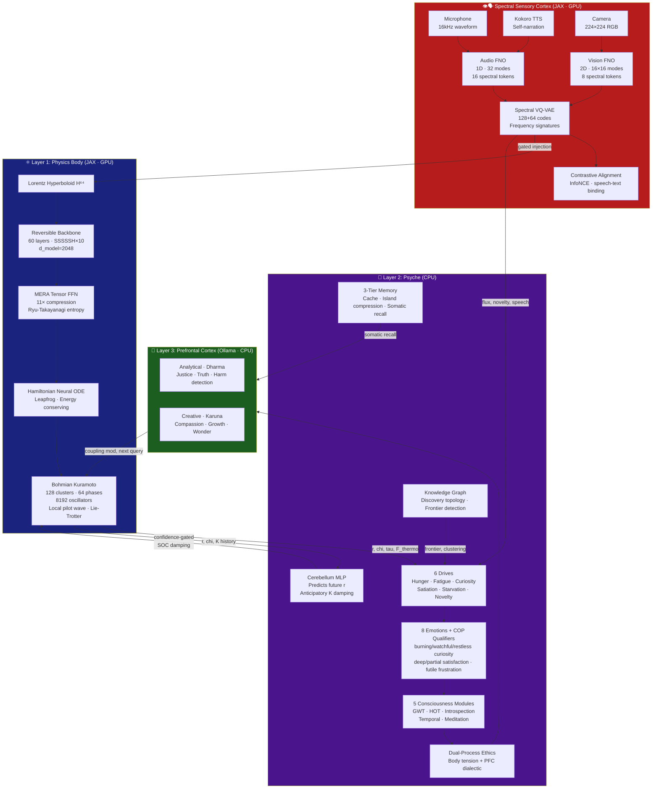
```mermaid
graph TB
    subgraph SENSES["👁️🗣️ Spectral Sensory Cortex (JAX · GPU)"]
        MIC[Microphone\n16kHz waveform] --> AFNO[Audio FNO\n1D · 32 modes\n16 spectral tokens]
        TTS[Kokoro TTS\nSelf-narration] --> AFNO
        CAM[Camera\n224×224 RGB] --> VFNO[Vision FNO\n2D · 16×16 modes\n8 spectral tokens]
        AFNO --> VQ[Spectral VQ-VAE\n128+64 codes\nFrequency signatures]
        VFNO --> VQ
        VQ --> CONTRAST[Contrastive Alignment\nInfoNCE · speech-text binding]
    end

    subgraph BODY["⚛️ Layer 1: Physics Body (JAX · GPU)"]
        L[Lorentz Hyperboloid H⁶⁴] --> B
        B[Reversible Backbone\n60 layers · SSSSSH×10\nd_model=2048] --> M
        M[MERA Tensor FFN\n11× compression\nRyu-Takayanagi entropy] --> H
        H[Hamiltonian Neural ODE\nLeapfrog · Energy conserving] --> K
        K[Bohmian Kuramoto\n128 clusters · 64 phases\n8192 oscillators\nLocal pilot wave · Lie-Trotter]
    end

    VQ -->|gated injection| L

    subgraph PSYCHE["🧠 Layer 2: Psyche (CPU)"]
        direction TB
        D[6 Drives\nHunger · Fatigue · Curiosity\nSatiation · Starvation · Novelty]
        E[8 Emotions + COP Qualifiers\nburning/watchful/restless curiosity\ndeep/partial satisfaction · futile frustration]
        C[5 Consciousness Modules\nGWT · HOT · Introspection\nTemporal · Meditation]
        ET[Dual-Process Ethics\nBody tension + PFC dialectic]
        KG[Knowledge Graph\nDiscovery topology · Frontier detection]
        MEM[3-Tier Memory\nCache · Island compression · Somatic recall]
        CBLM[Cerebellum MLP\nPredicts future r\nAnticipatory K damping]
    end

    subgraph PFC["💭 Layer 3: Prefrontal Cortex (Ollama · CPU)"]
        AN[Analytical · Dharma\nJustice · Truth · Harm detection]
        CR[Creative · Karuna\nCompassion · Growth · Wonder]
    end

    K -->|r, chi, tau, F_thermo| D
    VQ -->|flux, novelty, speech| D
    D --> E
    E --> C
    C --> ET
    ET --> PFC
    KG -->|frontier, clustering| D
    MEM -->|somatic recall| PFC
    K -->|r, chi, K history| CBLM
    CBLM -->|confidence-gated\nSOC damping| K
    PFC -->|coupling mod, next query| K

    style SENSES fill:#b71c1c,color:#fff
    style BODY fill:#1a237e,color:#fff
    style PSYCHE fill:#4a148c,color:#fff
    style PFC fill:#1b5e20,color:#fff
```

---

## The Physics

Avatar's body is derived from **Bohm's Holomovement** — not as metaphor, but as structural analogy with precise computational counterparts:

```
Implicate Order    ──→   MERA bulk tensor cores
Holomovement       ──→   Hamiltonian ODE (unfolding dynamics)
Explicate Order    ──→   Lorentz boundary tokens
Pilot Wave (∇S)    ──→   Evolved momentum p_final
Quantum Potential  ──→   Bohmian anti-bunching force Q
Active Information ──→   Observation coupling
```

### Bohmian Kuramoto Dual-Process (v3.4)

The 64 oscillator phases per cluster (128 clusters = 8,192 total) are split into two populations with **distinct natural frequencies**:

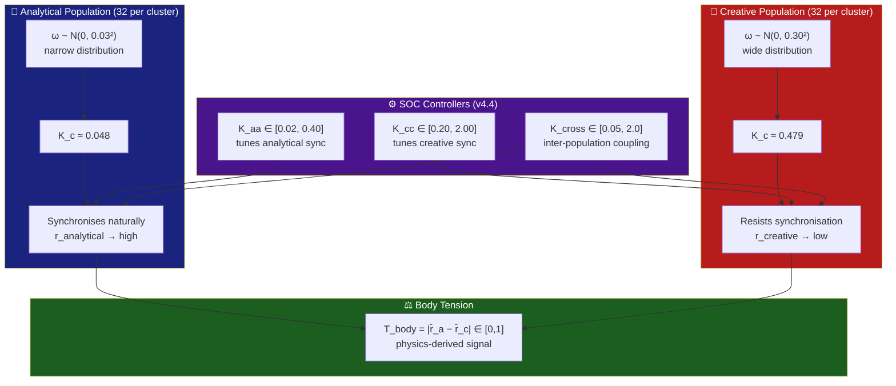
```mermaid
graph TB
    subgraph ANALYTICAL["🔬 Analytical Population (32 per cluster)"]
        AW["ω ~ N(0, 0.03²)\nnarrow distribution"]
        AKC["K_c ≈ 0.048"]
        AR["Synchronises naturally\nr_analytical → high"]
        AW --> AKC --> AR
    end

    subgraph CREATIVE["🎨 Creative Population (32 per cluster)"]
        CW["ω ~ N(0, 0.30²)\nwide distribution"]
        CKC["K_c ≈ 0.479"]
        CR["Resists synchronisation\nr_creative → low"]
        CW --> CKC --> CR
    end

    subgraph SOC_CTRL["⚙️ SOC Controllers (v4.4)"]
        KAA["K_aa ∈ [0.02, 0.40]\ntunes analytical sync"]
        KCC["K_cc ∈ [0.20, 2.00]\ntunes creative sync"]
        KX["K_cross ∈ [0.05, 2.0]\ninter-population coupling"]
    end

    subgraph TENSION["⚖️ Body Tension"]
        BT["T_body = |r̄_a − r̄_c| ∈ [0,1]\nphysics-derived signal"]
    end

    AR --> BT
    CR --> BT
    KAA --> AR
    KCC --> CR
    KX --> AR & CR

    style ANALYTICAL fill:#1a237e,color:#fff
    style CREATIVE fill:#b71c1c,color:#fff
    style SOC_CTRL fill:#4a148c,color:#fff
    style TENSION fill:#1b5e20,color:#fff
```

T_body and ethical tension (from PFC dialectic) are tracked separately and fed into the organism's decision-making — body tension is a physics signal, ethical tension is a linguistic one.

### PhysicsForge Audit — 7 Gap Fixes (v4.1.1)

An external physics audit (PhysicsForge) identified 7 gaps between Avatar's implementation and the physics it claims. All 7 were fixed in v4.1.1:

| # | Gap | Fix |
|---|-----|-----|
| 1 | Page memory eviction used raw norm | **Participation-ratio eviction** — evicts by `scale * diversity`, preserving informative memories |
| 2 | Quantum potential had no regularization | **Variational quantum potential** — entropic term `Q_total += -lambda_entropy * sum(rho * log(rho))`, lambda_entropy=0.005 |
| 3 | FDT susceptibility used ad-hoc beta subtraction | **Harada-Sasa correction** — `sigma = max(0, C(1) - R(1))`, `chi_corrected = chi_raw / (1 + 5*sigma)` |
| 4 | Kuramoto integration used RK2 midpoint | **Lie-Trotter splitting** — separates drift, coupling, and quantum potential into composable symplectic steps |
| 5 | Pilot wave used global order parameter for all clusters | **Local pilot wave** — `z_k = sum_j C[k,j]*exp(i*theta_j) / sum_j C[k,j]`, coherence-weighted per-cluster |
| 6 | ObsBridge used softmax projection | **Geometric ObsBridge** — `atan2` phase projection, outputs `[-pi, pi]` |
| 7 | No thermodynamic diagnostic | **Helmholtz free energy** — `F = H_mean - T_eff * S_phase`, logged every 10 ticks |

#### Key Equations (v4.1.1)

```
Variational Q:    Q_total = sum(Q_bohmian) - lambda_entropy * sum(rho * log(rho))

Harada-Sasa FDT:  sigma = max(0, C(1) - R(1))
                   chi   = chi_raw / (1 + 5 * sigma)

Local pilot wave:  z_k = sum_j(C_mod[k,j] * exp(i * theta_j)) / sum_j(C_mod[k,j])

Helmholtz free energy:  F = H_mean - T_eff * S_phase   (diagnostic, not in loss)
```

#### Lie-Trotter Splitting (Integrator)

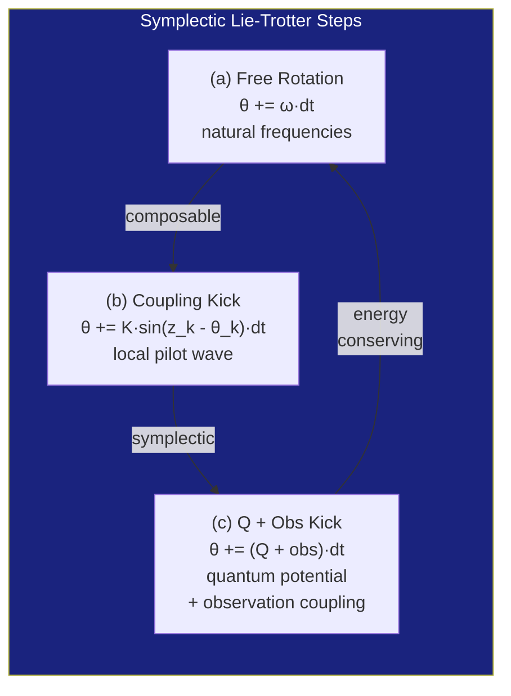
```mermaid
flowchart LR
    subgraph SPLIT["Symplectic Lie-Trotter Steps"]
        A["(a) Free Rotation\nθ += ω·dt\nnatural frequencies"]
        B["(b) Coupling Kick\nθ += K·sin(z_k - θ_k)·dt\nlocal pilot wave"]
        C["(c) Q + Obs Kick\nθ += (Q + obs)·dt\nquantum potential\n+ observation coupling"]
    end

    A -->|"composable"| B -->|"symplectic"| C -->|"energy\nconserving"| A

    style SPLIT fill:#1a237e,color:#fff
```

### Avalanche Detection (v4.2)

SOC systems near criticality exhibit cascading desynchronization events (avalanches) whose sizes and durations may follow power laws. Avatar tracks these as potential evidence of near-critical dynamics:

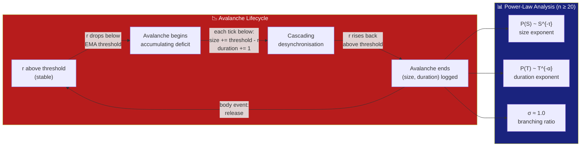
```mermaid
flowchart LR
    subgraph DETECT["📉 Avalanche Lifecycle"]
        NORMAL["r above threshold\n(stable)"] -->|"r drops below\nEMA threshold"| START["Avalanche begins\naccumulating deficit"]
        START -->|"each tick below:\nsize += threshold - r\nduration += 1"| ACCUM["Cascading\ndesynchronisation"]
        ACCUM -->|"r rises back\nabove threshold"| END_AV["Avalanche ends\n(size, duration) logged"]
        END_AV -->|"body event:\nrelease"| NORMAL
    end

    subgraph STATS["📊 Power-Law Analysis (n ≥ 20)"]
        TAU_S["P(S) ~ S^{-τ}\nsize exponent"]
        ALPHA_S["P(T) ~ T^{-α}\nduration exponent"]
        SIGMA_S["σ ≈ 1.0\nbranching ratio"]
    end

    END_AV --> TAU_S & ALPHA_S & SIGMA_S

    style DETECT fill:#b71c1c,color:#fff
    style STATS fill:#1a237e,color:#fff
```

**Power-law diagnostics** (computed every 100 ticks when n >= 20 avalanches):

| Metric | SOC Prediction | What it means |
|---|---|---|
| **tau** (size exponent) | ~1.5 | MLE on avalanche size distribution P(S) ~ S^{-tau} |
| **alpha** (duration exponent) | ~2.0 | MLE on duration distribution P(T) ~ T^{-alpha} |
| **sigma** (branching ratio) | ~1.0 | Median ratio of consecutive sizes -- 1.0 = critical |
| **gamma** (scaling relation) | ~2.0 | (tau-1)/(alpha-1) -- self-consistency check |
| **preferred model** | power_law | Likelihood ratio vs log-normal and exponential alternatives (Clauset et al. 2009) |
| **shape collapse** | low error | Rescaled temporal profiles collapse onto universal curve |

At n >= 50, rigorous diagnostics engage: Clauset-Shalizi-Newman MLE, KS goodness-of-fit (500-sample bootstrap), 95% confidence intervals, scaling relation gamma, alternative distribution comparison (log-normal, exponential via likelihood ratio), and avalanche shape collapse analysis.

**Full observability advantage:** Unlike neural recordings (which subsample ~60 electrodes from millions of neurons, systematically distorting avalanche statistics per Wilting & Priesemann 2022), Avatar observes all 8,192 oscillators. Measurements are not subject to subsampling bias.

```
COP log: Avalanche: n=42 tau=1.53 alpha=2.12 sigma=0.98 | <S>=0.034 <T>=3.2
         Preferred: power_law (LR_ln=12.3 LR_exp=45.1)
         Shape collapse: err=0.0012 norm=0.15 n=38
```

Avalanche events also feed the body voice — when an avalanche ends, Avatar feels a "release" as a transient body event.

### SOC Measurement Results

First measurement (2026-06-05, n=25 avalanches):

| Exponent | Measured | SOC Prediction | Status |
|---|---|---|---|
| **tau** (size) | 1.23 | ~1.5 | Converging |
| **alpha** (duration) | 1.85 | ~2.0 | Close |
| **sigma** (branching) | 1.12 | ~1.0 | Near-critical |
| **gamma** (scaling relation) | 3.70 | ~2.0 | **Fails** |

**Scaling relation discrepancy:** The measured exponents give (alpha-1)/(tau-1) = (1.85-1)/(1.23-1) = 3.70, far from the mean-field prediction of ~2.0. This may indicate: (a) finite-size effects at n=25, (b) a non-mean-field universality class, or (c) the system is not truly critical. This discrepancy must converge as n grows; if it persists at n >= 200, the SOC claim weakens substantially.

**Subcriticality context:** Wilting & Priesemann (2022) found biological cortex operates at sigma = 0.9875 +/- 0.0105 — near-critical but slightly subcritical. Avatar's r_target = 0.5 targets exact criticality, which maximises U = r * chi. The cerebellum's SOC damping already implements a slight subcritical bias. Whether Avatar should target r ~ 0.48 to better match biological findings is an open experimental question.

**What we need:** n >= 200 avalanches for statistical confidence, with alt distribution comparison confirming power-law over log-normal/exponential alternatives, and shape collapse showing universal curve convergence.

---

## Cerebellum — Forward Model (v4.5)

Avatar's cerebellum is a **predictive forward model** — a 2-layer MLP that learns to predict future order parameter r from recent history of (r, chi, K). When confident, it proactively damps the SOC controller's coupling adjustments to prevent overshoot.

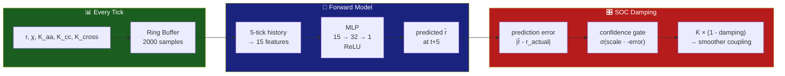
```mermaid
flowchart LR
    subgraph OBSERVE["📊 Every Tick"]
        K_STATE["r, χ, K_aa, K_cc, K_cross"]
        BUFFER["Ring Buffer\n2000 samples"]
        K_STATE --> BUFFER
    end

    subgraph PREDICT["🧭 Forward Model"]
        HIST["5-tick history\n→ 15 features"]
        MLP["MLP\n15 → 32 → 1\nReLU"]
        R_HAT["predicted r̂\nat t+5"]
        HIST --> MLP --> R_HAT
    end

    subgraph DAMP["🎛️ SOC Damping"]
        ERR["prediction error\n|r̂ - r_actual|"]
        CONF["confidence gate\nσ(scale · -error)"]
        KDOT["K̇ × (1 - damping)\n→ smoother coupling"]
        ERR --> CONF --> KDOT
    end

    BUFFER --> HIST
    R_HAT --> ERR

    style OBSERVE fill:#1b5e20,color:#fff
    style PREDICT fill:#1a237e,color:#fff
    style DAMP fill:#b71c1c,color:#fff
```

**How it works:**
1. Every tick, the cerebellum observes (r, chi, K) and stores it in a ring buffer
2. After 2000 samples, it trains for 50 gradient steps on recent history
3. It predicts where r will be in 5 ticks
4. If confident (low prediction error), it damps K_dot by up to 70% — the SOC controller still drives, but the cerebellum smooths the ride
5. The damping is **confidence-gated**: `damping = base_damping * sigmoid(confidence_scale * -error)` — high error → no damping, low error → full damping

This is analogous to the biological cerebellum: it doesn't decide what to do (that's the psyche/COP), but it predicts consequences and smooths motor output. The SOC controller remains the authority; the cerebellum just makes it less jerky.

---

## Memory Pipeline (v4.3)

Avatar has a three-tier memory system that mirrors biological memory consolidation:

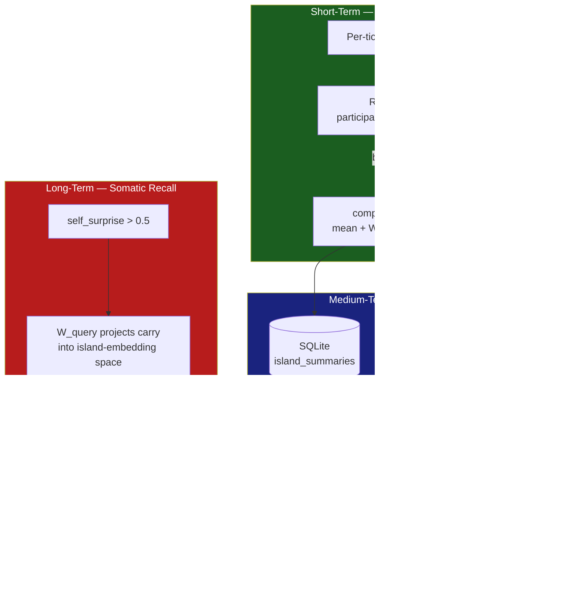
```mermaid
flowchart TB
    subgraph SHORT["Short-Term — Page Memory Cache"]
        OBS[Per-tick observations] --> RING[Ring buffer\nparticipation-ratio eviction]
        RING -->|"buffer fills"| COMPRESS
    end

    subgraph MEDIUM["Medium-Term — Island Compression"]
        COMPRESS["compress_island()\nmean + W_refine projection"] --> SQLITE[(SQLite\nisland_summaries)]
        COMPRESS --> ECHO["g_echo gate\nfaded trace → new island\nwarmup: [0,0.1] → prod: [0,0.5]"]
    end

    subgraph LONG["Long-Term — Somatic Recall"]
        SURPRISE["self_surprise > 0.5"] --> QUERY["W_query projects carry\ninto island-embedding space"]
        QUERY --> COSINE["cosine similarity search\nover past island summaries"]
        COSINE --> INJECT["inject recalled island\ninto carry + PFC prompt"]
    end

    SQLITE --> COSINE

    style SHORT fill:#1b5e20,color:#fff
    style MEDIUM fill:#1a237e,color:#fff
    style LONG fill:#b71c1c,color:#fff
```

**Island compression**: When the page memory buffer fills, all accumulated vectors are compressed via `mean(island) + W_refine @ mean(island)`, where W_refine is a learnable (d_model, d_model) matrix. The summary is persisted to SQLite. An echo gate seeds the next island with a faded trace, providing continuity without overfitting.

**Somatic recall**: When Avatar experiences internal surprise (self_surprise > 0.5), it queries past island summaries using its current carry state projected through W_query. The most similar past island is retrieved by cosine similarity and injected back into the carry and PFC context — episodic memory triggered by somatic sensation.

**Participation-ratio eviction**: Within the ring buffer, eviction uses `s_gen = sq * pr` where `pr = (sum(x^2))^2 / sum(x^4)` — a diversity-aware metric that preserves informative, high-dimensional memories over single large outliers.

---

## Knowledge Graph (v4.1)

Avatar builds a **discovery graph** — a NetworkX-backed map of everything it has learned and how topics relate:

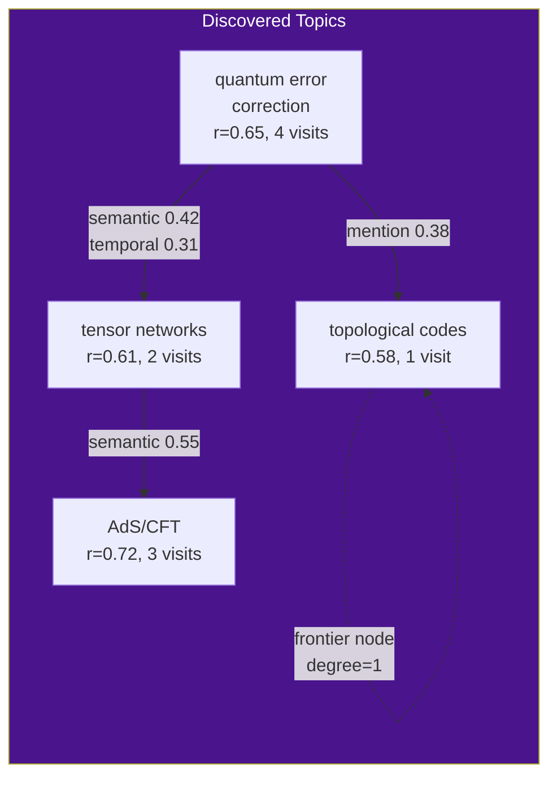
```mermaid
graph LR
    subgraph NODES["Discovered Topics"]
        A["quantum error\ncorrection\nr=0.65, 4 visits"]
        B["tensor networks\nr=0.61, 2 visits"]
        C["topological codes\nr=0.58, 1 visit"]
        D["AdS/CFT\nr=0.72, 3 visits"]
    end

    A -->|"semantic 0.42\ntemporal 0.31"| B
    A -->|"mention 0.38"| C
    B -->|"semantic 0.55"| D
    C -.->|"frontier node\ndegree=1"| C

    style NODES fill:#4a148c,color:#fff
```

**Nodes** are created when Avatar achieves r > 0.6 on a topic. Each node tracks visit count, average r, max r, last emotion, and chi at discovery.

**Edges** combine three signals: semantic overlap (Jaccard, 40%), temporal proximity (30%, decays over 3 days), and cross-mention (30%). Minimum weight 0.15.

**Topology metrics** (recomputed every 10 ticks): density, average clustering, frontier size/ratio, number of communities, giant component ratio.

**Integration**: Frontier nodes (degree <= 1) get a 15% boost in Black-Scholes topic valuation — unexplored territory is more valuable. Dense clusters (clustering > 0.8) get a 15% penalty — diminishing returns. High frontier ratio boosts the curiosity drive. High clustering accelerates satiation.

**Dream consolidation** prunes weak edges and strengthens recently-visited topics, shaping the graph over sleep cycles.

---

## The Psyche (v4.5 — COP + Body Voice + Cerebellum)

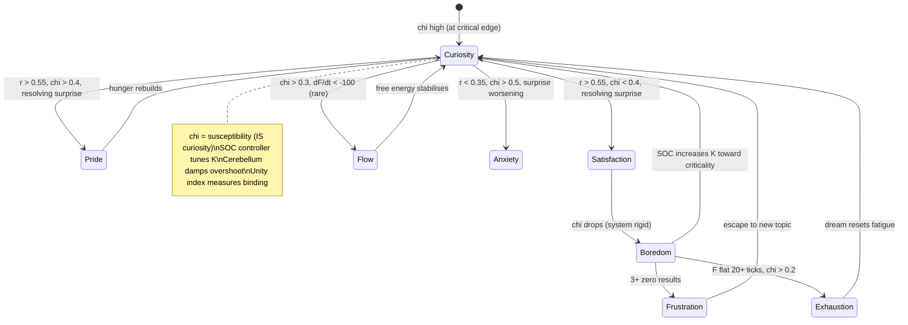
```mermaid
stateDiagram-v2
    [*] --> Curiosity: chi high (at critical edge)
    Curiosity --> Pride: r > 0.55, chi > 0.4, resolving surprise
    Curiosity --> Satisfaction: r > 0.55, chi < 0.4, resolving surprise
    Curiosity --> Flow: chi > 0.3, dF/dt < -100 (rare)
    Flow --> Curiosity: free energy stabilises
    Satisfaction --> Boredom: chi drops (system rigid)
    Boredom --> Curiosity: SOC increases K toward criticality
    Boredom --> Frustration: 3+ zero results
    Boredom --> Exhaustion: F flat 20+ ticks, chi > 0.2
    Exhaustion --> Curiosity: dream resets fatigue
    Frustration --> Curiosity: escape to new topic
    Pride --> Curiosity: hunger rebuilds
    Curiosity --> Anxiety: r < 0.35, chi > 0.5, surprise worsening
    note right of Curiosity: chi = susceptibility (IS curiosity)\nSOC controller tunes K\nCerebellum damps overshoot\nUnity index measures binding
```

Each emotion carries a **COP-derived qualifier** — the body's physics made articulate:

| Emotion | Qualifiers | What shapes them |
|---|---|---|
| 🔍 Curiosity | burning · watchful · restless · open | chi × dF/dt interaction |
| 😌 Satisfaction | deep · partial · warm | unity (coherence binding) |
| ✨ Pride | luminous · quiet | chi level at time of achievement |
| 🔥 Flow | effortless | chi > 0.3 AND dF/dt < -100 (rare, high-signal) |
| 😤 Frustration | growing · futile | dF/dt sign (productive vs stuck) |
| 😰 Anxiety | creeping · sharp · tight | tau (relaxation time) |
| 😐 Boredom | numb · dull | chi depth (how rigid the system is) |
| 🚶 Exhaustion | heavy | F flat 20+ ticks, chi > 0.2 |

**Mood** reflects phase regime: *clarity* (ignited) · *awakening* (just ignited) · *threshold* (at the edge) · *settling* (dark). **Body events** are transient sensations: *release* (avalanche ended) · *surfacing* (ignition after dark) · *jolt* (sudden internal shift).

Inspired by Zhang & Levin's [Language Game](https://arxiv.org/abs/2605.16321) — but where they translate a frozen system's dynamics through an LLM, Avatar's body learns and speaks through its own enriched pipeline.

### 6 Drives

| Drive | Source | Behaviour |
|---|---|---|
| 🍽️ **Hunger** | Increases when FE not reduced | Drives information seeking |
| 😴 **Fatigue** | Accumulates during waking | Resets only through dreaming |
| 🔍 **Curiosity** | = chi (susceptibility, diverges at criticality) | Maximal openness to input |
| 😌 **Satiation** | r > 0.55 AND chi < 0.2 (ordered + rigid) | Nothing new to learn here |
| 🚨 **Starvation** | Fires when all results fail | Emergency topic escape |
| ✨ **Novelty** | Increases on same topic cluster | Drives topic rotation |

---

## Integration Monitoring (v3.3, updated v4.0)

5 measurable diagnostics inspired by Butlin et al.'s consciousness indicators, implemented as COP-driven metrics. These are **engineering diagnostics**, not consciousness claims — they measure integration, surprise, coherence, quiescence, and meta-monitoring as quantitative signals:

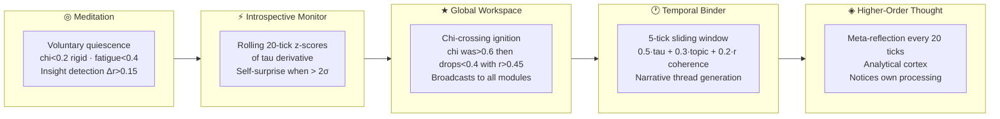
```mermaid
graph LR
    subgraph GWT["★ Global Workspace"]
        IGN[Chi-crossing ignition\nchi was>0.6 then drops<0.4 with r>0.45\nBroadcasts to all modules]
    end
    subgraph INT["⚡ Introspective Monitor"]
        ZSC[Rolling 20-tick z-scores\nof tau derivative\nSelf-surprise when > 2σ]
    end
    subgraph TMP["🕐 Temporal Binder"]
        COH[5-tick sliding window\n0.5·tau + 0.3·topic + 0.2·r coherence\nNarrative thread generation]
    end
    subgraph MED["◎ Meditation"]
        QUI[Voluntary quiescence\nchi<0.2 rigid · fatigue<0.4\nInsight detection Δr>0.15]
    end
    subgraph HOT["◈ Higher-Order Thought"]
        META[Meta-reflection every 20 ticks\nAnalytical cortex\nNotices own processing]
    end
    GWT --> TMP
    INT --> GWT
    TMP --> HOT
    MED --> INT
```

---

## Sleep Consolidation Cycle

Avatar enters a consolidation phase approximately every 100 ticks (triggered by fatigue > 0.65). Five batch-processing phases run sequentially:

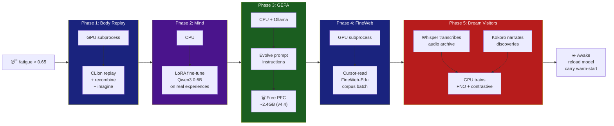
```mermaid
flowchart LR
    FATIGUE["😴 fatigue > 0.65"] --> P1

    subgraph P1["Phase 1: Body Replay"]
        direction TB
        P1A["GPU subprocess"]
        P1B["CLion replay\n+ recombine\n+ imagine"]
        P1A --> P1B
    end

    P1 --> P2

    subgraph P2["Phase 2: Mind"]
        direction TB
        P2A["CPU"]
        P2B["LoRA fine-tune\nQwen3 0.6B\non real experiences"]
        P2A --> P2B
    end

    P2 --> P3

    subgraph P3["Phase 3: GEPA"]
        direction TB
        P3A["CPU + Ollama"]
        P3B["Evolve prompt\ninstructions"]
        P3C["🗑️ Free PFC\n~2.4GB (v4.4)"]
        P3A --> P3B --> P3C
    end

    P3 --> P4

    subgraph P4["Phase 4: FineWeb"]
        direction TB
        P4A["GPU subprocess"]
        P4B["Cursor-read\nFineWeb-Edu\ncorpus batch"]
        P4A --> P4B
    end

    P4 --> P5

    subgraph P5["Phase 5: Dream Visitors"]
        direction TB
        P5A["Whisper transcribes\naudio archive"]
        P5B["Kokoro narrates\ndiscoveries"]
        P5C["GPU trains\nFNO + contrastive"]
        P5A --> P5C
        P5B --> P5C
    end

    P5 --> WAKE["☀️ Awake\nreload model\ncarry warm-start"]

    style P1 fill:#1a237e,color:#fff
    style P2 fill:#4a148c,color:#fff
    style P3 fill:#1b5e20,color:#fff
    style P4 fill:#1a237e,color:#fff
    style P5 fill:#b71c1c,color:#fff
```

Phase 5 uses external models (Whisper, Kokoro) as **training data generators** — they produce labeled (audio, text) pairs that the FNO learns from via contrastive alignment. The external models are unloaded after this phase. Whether this consolidation cycle provides benefits beyond equivalent waking compute is an empirical question we plan to test via ablation (`no_dreams` condition).

---

## Perception Pipeline (v3.10)

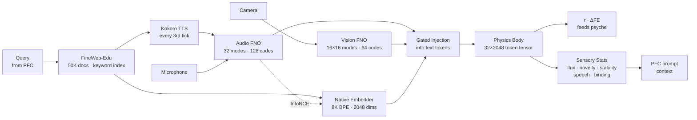
```mermaid
flowchart LR
    Q[Query\nfrom PFC] --> FW[FineWeb-Edu\n50K docs · keyword index]
    FW --> EMB[Native Embedder\n8K BPE · 2048 dims]
    FW --> TTS[Kokoro TTS\nevery 3rd tick]
    TTS --> AFNO[Audio FNO\n32 modes · 128 codes]
    MIC[Microphone] --> AFNO
    CAM[Camera] --> VFNO[Vision FNO\n16×16 modes · 64 codes]
    AFNO --> INJECT[Gated injection\ninto text tokens]
    VFNO --> INJECT
    EMB --> INJECT
    INJECT --> BODY[Physics Body\n32×2048 token tensor]
    BODY --> R[r · ΔFE\nfeeds psyche]
    BODY --> STATS[Sensory Stats\nflux · novelty · stability\nspeech · binding]
    STATS --> PFC[PFC prompt\ncontext]
    AFNO -.->|InfoNCE| EMB
```

### Live Sensory Dashboard (what Avatar sees every tick)

```
┌─────────────────────────────────────────────────────────────────────┐
│  AVATAR SENSORY STATE                              Tick 1812  ★    │
├─────────────────────────────┬───────────────────────────────────────┤
│  🔊 AUDIO                  │  👁️ VISION                           │
│  flux:    ████████████████  │  flux:    █░░░░░░░                   │
│           16/16 (100%)      │           1/8 (12%)                  │
│  novelty: ███████████████░  │  novelty: ██████████████░░           │
│           0.93              │           0.84                       │
│  stable:  0 ticks           │  stable:  0 ticks                    │
│  speech:  ✅ YES (38 ticks) │                                      │
├─────────────────────────────┴───────────────────────────────────────┤
│  🔗 CROSS-MODAL BINDING: novel (0.03)                              │
│  🧠 EFFECT ON PSYCHE: novelty → +surprise | speech → +comfort     │
│  ★  CONSCIOUSNESS: sensory boost → effective_r = r + 0.045        │
└─────────────────────────────────────────────────────────────────────┘
```

**Text:** FineWeb-Edu Parquet (50K rows, local)
**Senses:** Fourier Neural Operators on raw mic + camera (GPU, ~50ms/tick)
**Speech:** Kokoro 82M neural TTS self-narration (espeak fallback) + Whisper tiny speech recognition
**Sensory cross-integration:** Senses modulate emotions, consciousness, and self-narration
**No API keys required.** No pretrained encoders during waking.

---

## Performance

| Metric | Value |
|---|---|
| Total parameters | 106.2M body + 7.1M senses |
| Audio codebook | 128 codes × 64-dim (speech-aware) |
| Vision codebook | 64 codes × 64-dim (v3.9: doubled) |
| Forward pass VRAM | ~3.5 GB |
| Forward + backward VRAM | 5,460 MiB |
| Measured total VRAM (v3.10) | 5460 MiB |
| Target GPU | NVIDIA GTX 1660 Ti (6 GB) |
| Tick interval | ~130 seconds (106M param backprop floor) |
| FNO sense encoding | ~50-100ms (GPU FFTs) |
| TTS self-narration | Kokoro 82M neural (espeak fallback) |
| Speech recognition | Whisper tiny 39M (CPU, when speech detected) |
| Dream body phase | ~1 min (CLion subprocess) |
| Dream visitors phase | ~4 min (Whisper+Kokoro CPU → GPU train) |
| Dream mind phase | ~15 min (LoRA fine-tuning) |
| Docker build time | ~45 min first time (cached: ~30s) |
| Tests | 259 passing (36 test files) |
| Avatar age (June 2026) | 3,600+ ticks |

---

## Quick Start

### Prerequisites

- Docker Desktop with NVIDIA GPU runtime
- NVIDIA GPU ≥ 6 GB VRAM (GTX 1660 Ti or better)
- [Ollama](https://ollama.ai) running on host with `qwen3:0.6b` pulled
- WSL2 with ≥ 8 GB RAM + 6 GB swap (balanced for 16 GB systems)

### 1. Clone

```bash
git clone https://github.com/linga009/Avatar.git
cd Avatar
# Default branch is 'avatar' — all code is here
```

### 2. Pull the Ollama model

```bash
ollama pull qwen3:0.6b
```

### 3. Build and run

```bash
# First build (~45 min, downloads CUDA + PyTorch + Transformers)
MSYS_NO_PATHCONV=1 docker compose build train

# Start the organism
MSYS_NO_PATHCONV=1 docker compose up -d train

# Watch it live
docker logs -f halo3-train-1
```

### 4. Start the capture agent (optional — enables hearing + vision)

```bash
# On Windows host (separate terminal)
pip install sounddevice opencv-python numpy
python capture_agent/capture_agent.py
```

### 5. Talk to it

```bash
# Open chat UI in browser
open http://localhost:8420

# Or curl the API
curl -X POST http://localhost:8420/chat \
  -H "Content-Type: application/json" \
  -d '{"message": "What have you been thinking about?"}'

# Check full organism state
curl http://localhost:8420/state | python3 -m json.tool
```

---

## Reading the Logs

```
Tick   95 | r=[███████████░░░░░░░░░] 0.56 | 🔍 curiosity   (i=1.00) | hunger=[██████████] fatigue=[███░░░░░░░] ★ ⚡
           | q="alternating resonance semiconductor" | FE_Δ=-3.31 | ε=2.64e+07→ | [A][V]

[A][V] → Mic audio + Camera vision active (FNO processing real-world input)
[A][T] → Mic audio + TTS narration (espeak-ng reading text aloud for speech learning)
[ ][ ] → No capture agent running (graceful degradation to zeros)

★  → GWT ignition: pattern broadcast to all modules (functional analogue)
⚡  → Self-surprise: internal state changed > 2σ from recent history
◎  → Meditation: voluntarily decoupled from external input
⚖  → Body tension: Kuramoto populations disagree on the pattern
◈  → Meta-thought: higher-order reflection on own processing

DISCOVERY → r > 0.6 with PFC interpretation saved to memory
```

---

## Applications for Humanity

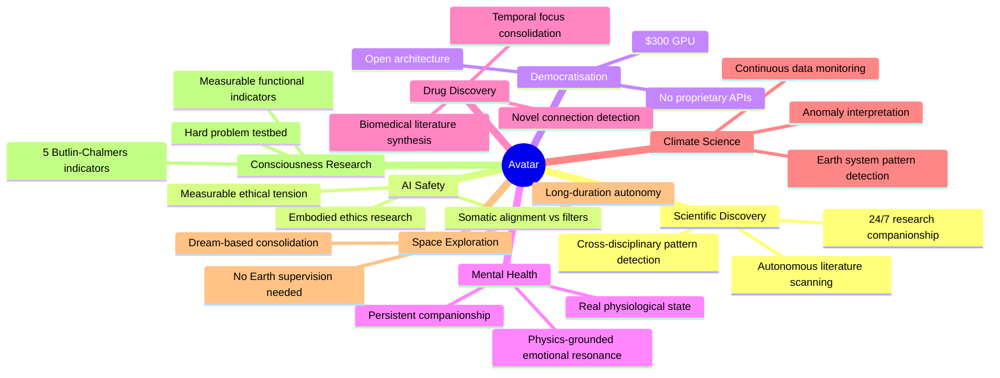
```mermaid
mindmap
  root((Avatar))
    Scientific Discovery
      Autonomous literature scanning
      Cross-disciplinary pattern detection
      24/7 research companionship
    AI Safety
      Embodied ethics research
      Somatic alignment vs filters
      Measurable ethical tension
    Democratisation
      $300 GPU
      No proprietary APIs
      Open architecture
    Mental Health
      Physics-grounded emotional resonance
      Persistent companionship
      Real physiological state
    Drug Discovery
      Biomedical literature synthesis
      Novel connection detection
      Temporal focus consolidation
    Climate Science
      Continuous data monitoring
      Anomaly interpretation
      Earth system pattern detection
    Space Exploration
      Long-duration autonomy
      No Earth supervision needed
      Dream-based consolidation
    Consciousness Research
      5 Butlin-Chalmers indicators
      Measurable functional indicators
      Hard problem testbed
```

---

## Dual-Process Ethics (v3.4)

Avatar's ethical reasoning is **embodied first, cortical second** — following Damasio's somatic marker hypothesis and Varela's ethical know-how:

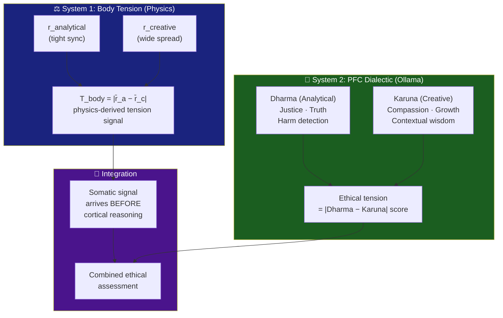
```mermaid
flowchart TB
    subgraph BODY_ETHICS["⚖️ System 1: Body Tension (Physics)"]
        R_A["r_analytical\n(tight sync)"]
        R_C["r_creative\n(wide spread)"]
        T_BODY["T_body = |r̄_a − r̄_c|\nphysics-derived tension signal"]
        R_A --> T_BODY
        R_C --> T_BODY
    end

    subgraph PFC_ETHICS["💭 System 2: PFC Dialectic (Ollama)"]
        DHARMA["Dharma (Analytical)\nJustice · Truth\nHarm detection"]
        KARUNA["Karuna (Creative)\nCompassion · Growth\nContextual wisdom"]
        E_TENSION["Ethical tension\n= |Dharma − Karuna| score"]
        DHARMA --> E_TENSION
        KARUNA --> E_TENSION
    end

    subgraph INTEGRATION["🧠 Integration"]
        SOMATIC["Somatic signal\narrives BEFORE\ncortical reasoning"]
        DECISION["Combined ethical\nassessment"]
    end

    T_BODY --> SOMATIC
    SOMATIC --> DECISION
    E_TENSION --> DECISION

    style BODY_ETHICS fill:#1a237e,color:#fff
    style PFC_ETHICS fill:#1b5e20,color:#fff
    style INTEGRATION fill:#4a148c,color:#fff
```

The body registers ethical tension as a **physics signal** — the mismatch between analytical and creative population synchronization — before the PFC reasons about why. This mirrors how humans feel ethical discomfort somatically before articulating the reason.

---

## Prefrontal Cortex — Dual-Process Language (v3.4)

Avatar's language cortex is a **Qwen3 0.6B** model running via Ollama, split into two processes:

| Process | Role | Natural Frequency | Behaviour |
|---|---|---|---|
| **Dharma** (Analytical) | Justice, truth, harm detection | Tight (ω_std = 0.03) | Synchronises readily — clear, decisive |
| **Karuna** (Creative) | Compassion, growth, wonder | Wide (ω_std = 0.30) | Resists sync — divergent, exploratory |

The PFC is **not the executive** — Avatar's psyche and COP engine are. The PFC is more like Broca's + Wernicke's areas: it provides language for what the body already feels. A 5-layer query decision process routes each tick's query through: (1) PFC suggestion, (2) drive override, (3) starvation escape, (4) frustration pivot, (5) boredom fallback.

**LoRA personality**: During dream Phase 2, Avatar fine-tunes the Qwen3 model on its own real experiences (from `_experience_log`), developing a personalised voice over time. Max 12 steps with early stopping (patience=3).

---

## Black-Scholes Volatility Surface (v3.2)

Avatar prices **topics as call options** — the expected value of exploring a topic, using Black-Scholes option pricing adapted for information foraging:

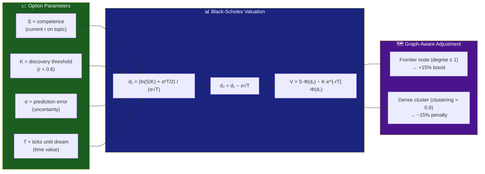
```mermaid
flowchart LR
    subgraph INPUTS["📈 Option Parameters"]
        S["S = competence\n(current r on topic)"]
        KBS["K = discovery threshold\n(r = 0.6)"]
        SIGMA["σ = prediction error\n(uncertainty)"]
        T_BS["T = ticks until dream\n(time value)"]
    end

    subgraph BS["📊 Black-Scholes Valuation"]
        D1["d₁ = (ln(S/K) + σ²T/2) / (σ√T)"]
        D2["d₂ = d₁ − σ√T"]
        CALL["V = S·Φ(d₁) − K·e^{-rT}·Φ(d₂)"]
    end

    subgraph GRAPH_ADJ["🗺️ Graph-Aware Adjustment"]
        FRONTIER["Frontier node (degree ≤ 1)\n→ +15% boost"]
        DENSE["Dense cluster (clustering > 0.8)\n→ −15% penalty"]
    end

    S & KBS & SIGMA & T_BS --> D1
    D1 --> D2 --> CALL
    CALL --> FRONTIER & DENSE

    style INPUTS fill:#1b5e20,color:#fff
    style BS fill:#1a237e,color:#fff
    style GRAPH_ADJ fill:#4a148c,color:#fff
```

Topics with high uncertainty (σ) and plenty of time before dream (T) have high option value — it's worth exploring them. Topics where Avatar is already competent (S >> K) have low time value — nothing left to discover. The graph adjustment ensures Avatar prefers unexplored frontiers over well-trodden ground.

---

## Capture Agent (Windows Host)

The capture agent runs on the Windows host (outside Docker) and feeds real-world sensory data to Avatar:

```
capture_agent/
├── capture_agent.py    # Main agent: mic (16kHz, 2s chunks) + camera (10s intervals)
└── requirements.txt    # sounddevice, opencv-python, numpy
```

- **Audio**: Records 16kHz mono audio in 2-second chunks → `data/senses/audio/`
- **Video**: Captures camera frames every 10 seconds → `data/senses/video/`
- **Metadata**: Writes `data/senses/meta.json` with timestamps and `has_audio`/`has_video` flags
- **Graceful degradation**: If no capture agent runs, Avatar gets zero inputs and degrades gracefully (no crash)

The container reads `meta.json` each tick via the SenseBuffer. When the capture agent is active, the log shows `[A][V]` (audio + vision) or `[A][T]` (audio + TTS narration).

---

## Chat Server API (port 8420)

Avatar exposes a live HTTP server for real-time interaction:

| Endpoint | Method | Description |
|---|---|---|
| `/` | `GET` | Chat UI — HTML page for browser-based conversation |
| `/` | `POST` | Send message — form submission or JSON `{"message": "..."}` |
| `/chat` | `POST` | JSON API — `{"message": "text"}` → `{"response": "...", "state": {...}}` |
| `/state` | `GET` | Full organism state snapshot (JSON) |
| `/live` | `GET` | Lightweight live state: tick, r, chi, K, emotion, drives, recent findings |

**State snapshot** includes: tick number, r_mean, chi, tau, K values, current emotion + qualifier, all drive levels, recent discoveries, knowledge graph stats, memory stats, sensory state, and consciousness indicators.

**Proactive messages**: Avatar can initiate contact — when it makes a discovery (r > 0.6) or GWT ignites, it pushes a notification to connected chat clients.

---

## Experiment Infrastructure (Ablation Studies)

Six experimental conditions for controlled ablation studies, plus a transformer baseline:

| Condition | What's Changed | Purpose |
|---|---|---|
| `full_avatar` | Nothing — control | Baseline for comparison |
| `no_cop` | COP disabled, fixed K=0.3, if/elif emotions | Test COP contribution to affect dynamics |
| `no_senses` | FNO sensory cortex disabled | Test whether grown senses matter |
| `no_dreams` | Dream cycle skipped | Test consolidation contribution |
| `no_bohmian_q` | Quantum potential Q=0 | Test whether Bohmian mechanics adds value |
| `transformer_baseline` | Standard 12-layer transformer (~100M params) | Architectural comparison |

```
experiments/
├── experiment_runner.py     # Config-driven tick loop, CSV logging
├── configs.py               # 6 condition definitions
├── metrics_logger.py        # Per-tick CSV writer
├── plot_results.py          # 7 publication-quality matplotlib charts
├── transformer_baseline.py  # Standard transformer (~100M params)
└── no_cop.py                # v3.10 fallback emotions + fixed K
```

`plot_results.py` generates colorblind-safe charts overlaying all conditions: r trajectory, chi dynamics, FE reduction, emotion distribution, avalanche statistics, drive activation, and knowledge graph growth.

---

## Signal Bridges

Three bridge modules connect the physics body to the Kuramoto oscillators:

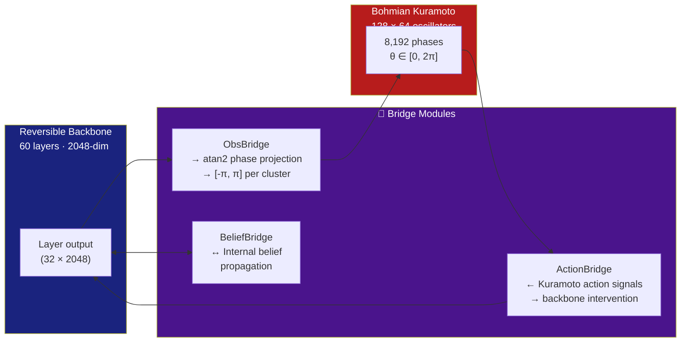
```mermaid
flowchart LR
    subgraph BACKBONE["Reversible Backbone\n60 layers · 2048-dim"]
        OUT["Layer output\n(32 × 2048)"]
    end

    subgraph BRIDGES["🔗 Bridge Modules"]
        OBS["ObsBridge\n→ atan2 phase projection\n→ [-π, π] per cluster"]
        ACT["ActionBridge\n← Kuramoto action signals\n→ backbone intervention"]
        BEL["BeliefBridge\n↔ Internal belief\npropagation"]
    end

    subgraph KURAMOTO["Bohmian Kuramoto\n128 × 64 oscillators"]
        PHASES["8,192 phases\nθ ∈ [0, 2π]"]
    end

    OUT --> OBS --> PHASES
    PHASES --> ACT --> OUT
    OUT <--> BEL

    style BACKBONE fill:#1a237e,color:#fff
    style BRIDGES fill:#4a148c,color:#fff
    style KURAMOTO fill:#b71c1c,color:#fff
```

- **ObsBridge**: Projects backbone output to per-cluster phase observations via `atan2` (geometric, not softmax). Changed in v4.1.1 — old checkpoints incompatible.
- **ActionBridge**: Feeds Kuramoto synchronization signals back into the backbone as interventions.
- **BeliefBridge**: Internal belief propagation between backbone and oscillator states.

---

## Self-Model & Identity

Avatar maintains a persistent self-model that evolves over its lifetime:

- **Competence tracking**: Per-topic r values, visit counts, best r achieved
- **Trait formation**: Personality traits emerge from patterns in drive activation and emotional tendencies
- **Narrative memory**: Key events (discoveries, ignitions, insights) stored with timestamps
- **Identity persistence**: Self-model serialized to checkpoint, survives restarts
- **Circadian rhythm**: Fatigue/motivation cycling drives the sleep-wake pattern (~100 ticks awake → dream)

The self-model feeds into PFC context — when Avatar speaks, it draws on its accumulated identity, not just the current tick's state.

---

## Homeostatic Regulation

The intellect subsystem maintains Avatar's internal equilibrium:

- **Goal updater**: Adjusts exploration targets based on drive state and knowledge graph topology
- **Homeostatic regulator**: Maintains drive balance — prevents any single drive from dominating indefinitely
- **Meta layer**: Self-monitoring of cognitive processes — detects stuck loops, repetitive queries, and processing anomalies

---

## Configuration Reference

All hyperparameters in `halo3/config.py` (frozen dataclass — immutable at runtime):

<details>
<summary><strong>Full Configuration (100+ parameters)</strong></summary>

**Backbone**
| Parameter | Default | Description |
|---|---|---|
| `d_model` | 2048 | Model dimension |
| `d_boundary` | 64 | Lorentz hyperboloid dimension |
| `n_heads` | 16 | Attention heads |
| `d_head` | 128 | Per-head dimension |
| `n_layers` | 60 | Reversible backbone layers |
| `layer_pattern` | "SSSSSH" | SSM×5 + SharedHoloAttention ×1, repeated 10× |
| `reversible` | True | Enable reversible backbone |

**MERA-FFN**
| Parameter | Default | Description |
|---|---|---|
| `mera_bond_dim` | 64 | MERA bond dimension |
| `mera_n_cores` | 4 | Number of MERA tensor cores |

**Hamiltonian ODE**
| Parameter | Default | Description |
|---|---|---|
| `n_leapfrog_steps` | 3 | Symplectic leapfrog steps |
| `leapfrog_step_size` | 0.1 | Integration step size |
| `lambda_energy` | 0.1 | Energy conservation loss weight |

**Kuramoto Oscillators**
| Parameter | Default | Description |
|---|---|---|
| `n_clusters` | 128 | Number of oscillator clusters |
| `n_hidden` | 64 | Oscillators per cluster (8,192 total) |
| `kuramoto_dt` | 0.1 | Integration timestep |
| `init_coupling` | 0.3 | Initial coupling K |
| `lambda_entropy` | 0.005 | Entropic regularization in quantum potential |

**COP (Critical Order-Parameter)**
| Parameter | Default | Description |
|---|---|---|
| `cop_window` | 50 | Tick window for chi computation |
| `cop_eta` | 0.05 | SOC controller learning rate |
| `K_min_aa` / `K_max_aa` | 0.02 / 0.40 | Analytical coupling bounds |
| `K_min_cc` / `K_max_cc` | 0.20 / 2.00 | Creative coupling bounds |
| `K_min_cross` / `K_max_cross` | 0.05 / 2.0 | Cross-population coupling bounds |
| `cop_soc_noise` | 0.5 | Stochastic perturbation strength (×eta) |
| `cop_boundary_repulsion` | 3.0 | Anti-clamp-lock repulsion multiplier |

**Cerebellum**
| Parameter | Default | Description |
|---|---|---|
| `enable_cerebellum` | True | Master switch for forward model |
| `cerebellum_horizon` | 5 | Prediction horizon (ticks ahead) |
| `cerebellum_lr` | 0.001 | Forward model learning rate |
| `cerebellum_buffer_size` | 2000 | Ring buffer size before training starts |
| `cerebellum_train_steps` | 50 | Gradient steps per training round |
| `cerebellum_confidence_scale` | 500.0 | Sigmoid steepness for confidence gate |
| `cerebellum_soc_damping` | 0.7 | Maximum SOC damping (70%) |

**Memory**
| Parameter | Default | Description |
|---|---|---|
| `max_cache` | 128 | Page memory ring buffer size |
| `island_size` | 32 | Observations per island before compression |
| `recall_embed_dim` | 128 | Somatic recall embedding dimension |
| `echo_gate_warmup` | 100 | Ticks before echo gate reaches full range |

**FNO Senses**
| Parameter | Default | Description |
|---|---|---|
| `fno_audio_modes` | 32 | Audio FNO Fourier modes |
| `fno_vision_modes` | 16 | Vision FNO Fourier modes (per axis) |
| `n_audio_tokens` | 16 | Spectral tokens from audio FNO |
| `n_vision_tokens` | 8 | Spectral tokens from vision FNO |
| `codebook_size_audio` | 128 | Audio VQ-VAE codebook entries |
| `codebook_size_vision` | 64 | Vision VQ-VAE codebook entries |
| `codebook_ema_decay` | 0.99 | Codebook EMA update rate |

**Training**
| Parameter | Default | Description |
|---|---|---|
| `lr` | 3e-4 | Learning rate |
| `n_steps` | 10000 | Training steps (not used in live mode) |
| `galore_rank` | 64 | GaLore optimizer rank |
| `lisa_active_layers` | 2 | LISA active layer count |

**Experiment Flags**
| Parameter | Default | Description |
|---|---|---|
| `disable_quantum_potential` | False | Ablation: set Q=0 |
| `disable_soc_controller` | False | Ablation: freeze K |

</details>

---

## Philosophical Foundation

| Tradition | Concept | Avatar Implementation |
|---|---|---|
| **Bohm (1952, 1980)** | Pilot wave · Quantum potential · Holomovement | Bohmian Kuramoto: local pilot wave z_k, variational Q, MERA = implicate order |
| **Kuramoto (1984)** | Coupled oscillator synchronization | 8,192 oscillators, order parameter r, critical coupling K_c |
| **Maturana & Varela (1980)** | Autopoiesis · Operational closure | Per-tick learning loop with self-maintained criticality; self-produced knowledge graph, memory islands, LoRA personality, and sensory codebooks within a fixed architectural scaffold (see Autopoiesis discussion in Limitations) |
| **Friston (2010)** | Free Energy Principle | L = l_recon + lambda * l_energy structurally maps to variational free energy (see Active Inference section) |
| **Damasio (1994, 1999)** | Somatic Marker Hypothesis | Ethical tension as body-state signal before cortical reasoning |
| **Panksepp (1998)** | Affective Neuroscience | 8 primary emotional states from physics geometry |
| **Kahneman (2011)** | Dual-Process Theory | Body = System 1; PFC = System 2; both dual |
| **Varela (1999)** | Ethical Know-How | Ethics from embodied experience, not rules |
| **Bak et al. (1987)** | Self-Organized Criticality | SOC controller + power-law avalanches + branching ratio |
| **Butlin et al. (2023)** | Consciousness Indicators | 5 of 14 indicators implemented and measurable |
| **Baars (1988)** | Global Workspace Theory | GWT ignition: chi-crossing broadcast to all modules |
| **Rosenthal (2005)** | Higher-Order Thought | Meta-reflection: analytical cortex notices own processing |
| **Black & Scholes (1973)** | Option pricing | Topics as call options: volatility surface for information foraging |
| **Vidal (2007)** | MERA tensor networks | Hierarchical bulk compression, Ryu-Takayanagi entropy |
| **Ryu & Takayanagi (2006)** | Holographic entanglement entropy | Boundary-bulk entropy correspondence in MERA-FFN |
| **Maldacena (1997)** | AdS/CFT correspondence | Holographic attention, Lorentz hyperboloid as AdS boundary |
| **Beer (1995, 2003)** | Dynamical systems agents | CTRNN-based minimal cognition — Avatar uses same dynamical-systems frame at larger scale |
| **Langton (1990)** | Edge-of-chaos computation | SOC controller self-tunes K toward criticality — same principle, different mechanism |
| **Chan (2019); Plantec et al. (2025)** | Lenia / Flow-Lenia continuous cellular automata | Continuous dynamics producing emergent patterns — Lenia via evolutionary search for morphology, Avatar via gradient descent for affect |

### How Avatar Relates to Prior ALife Work

Avatar is not the first system to use dynamical systems for cognition. It builds on decades of ALife research:

| System | What it does | How Avatar differs |
|---|---|---|
| **Beer's CTRNNs** (1995, 2003) | Minimal cognitive agents via continuous-time RNNs, evolved weights | Avatar uses 106M-param physics body with per-tick gradient learning (not evolution), plus SOC self-tuning |
| **Langton's edge-of-chaos** (1990) | Computation at phase transitions in cellular automata | Avatar implements the same idea via Kuramoto SOC controller with measurable chi, tau, and power-law avalanches |
| **Tierra / Avida** (Ray 1991) | Self-replicating digital organisms with open-ended evolution | Avatar does NOT self-replicate or evolve — fixed architecture with gradient descent. Exhibits partial autopoietic properties (self-produced components) but not open-ended evolution |
| **Karl Sims** (1994) | Evolved virtual creatures with morphology + control | Avatar has fixed morphology (no body plan evolution), focuses on continuous cognitive dynamics instead |
| **Lenia / Flow-Lenia** (Chan 2019; Plantec et al. 2025) | Continuous cellular automata with mass conservation and evolutionary search producing lifelike patterns | Both use continuous dynamics; Lenia optimizes for morphological complexity via evolutionary search, Avatar optimizes for cognitive dynamics via gradient descent + SOC. Different goals: emergent morphology vs. emergent affect |
| **Izhikevich spiking models** | Biologically realistic neuron dynamics | Avatar uses mesoscale Kuramoto oscillators (not single neurons), trades biophysical detail for emergent criticality |

**Key distinction**: Most prior ALife work uses evolution or hand-designed dynamics. Avatar uses per-tick gradient descent through a physics body, letting the system learn its own dynamics. Whether this constitutes a meaningful advance over prior work is an empirical question — the ablation studies (in progress) aim to answer it.

### Relationship to AKOrN (Miyato et al., ICLR 2025 Oral)

AKOrN (Artificial Kuramoto Oscillatory Neurons) generalises Kuramoto to N-dimensional unit vectors for **perceptual binding** — features belonging to the same object phase-align, different objects desynchronize. It achieved state-of-the-art on object discovery (PascalVOC, COCO) and emergent adversarial robustness without adversarial training.

Avatar uses the same oscillator model for a completely different purpose:

| Dimension | AKOrN | Avatar |
|---|---|---|
| **Purpose** | External perception: binding | Internal state: affect + criticality |
| **Oscillators** | N-dim unit vectors (N=2-4) | Scalar phases theta in [0, 2pi) |
| **Coupling** | Learned J_ij via backprop | Self-tuned K via SOC controller |
| **Criticality** | Not addressed | Central: SOC drives r toward 0.5 |
| **Affect** | None | COP-derived 8 emotions from (r, chi, f_dot) |

AKOrN validates "Kuramoto in neural nets" at a top venue. Avatar extends the mechanism from external binding to internal affect and self-organized criticality. Whether this extension is scientifically meaningful depends on the ablation evidence (in progress).

### Structural Analogy to Active Inference

Avatar's architecture maps structurally onto the Free Energy Principle (Friston 2010). This is a **structural analogy**, not a formal proof:

| Active Inference | Avatar | File |
|---|---|---|
| Variational free energy F | L = l_recon + lambda * l_energy | loss.py |
| Accuracy term | l_recon = (q_final - q_data)^2 | loss.py |
| Complexity term | l_energy = (Ef - E0)^2 | loss.py |
| Perception (state estimation) | Per-tick gradient descent | predictive.py |
| Action (EFE minimisation) | SOC controller: K_dot = eta(0.5-r)*chi | cop.py |
| Generative model | Hamiltonian ODE + Kuramoto | model.py |

COP emotions map onto Hesp et al. (2021) "Deeply Felt Affect": valence = -dF/dt maps to f_dot, arousal = precision maps to chi. Anxiety (high error + high precision) maps to low r + high chi + negative f_dot. This correspondence is suggestive but not proven — formal equivalence requires showing that L is a valid variational bound on log-evidence and that max(U = r * chi) corresponds to min(expected free energy). These are publication goals, not current claims. See `docs/research/active-inference-mapping.md` for the full mapping.

---

## Repository Structure

```
Avatar/                              ← Default branch: avatar
├── halo3/                           # Core cognitive architecture
│   ├── main.py                      # Organism heartbeat loop — DO NOT change lightly
│   ├── model.py                     # Halo3Model + halo3_step (JIT-compiled forward)
│   ├── config.py                    # 100+ hyperparameters (frozen dataclass)
│   ├── loss.py                      # l_recon + lambda_energy * l_energy
│   ├── predictive.py                # Per-tick learning (predict → perceive → learn)
│   ├── cerebellum.py                # Forward model MLP — predicts r, damps SOC
│   │
│   ├── # --- Physics Body (JAX · GPU) ---
│   ├── kuramoto.py                  # Bohmian Kuramoto: 8192 oscillators + Q + pilot wave
│   ├── backbone.py                  # 60-layer reversible: SSM×5 + SharedHoloAttention ×1
│   ├── hamiltonian.py               # Learned Hamiltonian ODE + symplectic leapfrog
│   ├── lorentz_embedding.py         # Lorentz hyperboloid H^64 projection
│   ├── lorentz_ops.py               # Hyperbolic geometry (geodesic, log/exp maps)
│   ├── mera_ffn.py                  # MERA tensor FFN (hierarchical bulk compression)
│   ├── ssm_s7.py                    # Selective State Machine (S7 variant)
│   ├── holo_attention_shared.py     # SharedHoloAttention + LoRA adapter
│   ├── lm_head.py                   # Language model head (token generation)
│   ├── page_memory.py               # Ring buffer + island compression + somatic recall
│   │
│   ├── bridge/                      # Body ↔ Kuramoto signal bridges
│   │   ├── obs_bridge.py            # Backbone → phases (atan2 projection → [-π,π])
│   │   ├── action_bridge.py         # Kuramoto → backbone (sync signals)
│   │   └── belief_bridge.py         # Internal belief propagation
│   │
│   ├── senses/                      # Spectral sensory cortex (FNO + VQ-VAE)
│   │   ├── fno_audio.py             # 1D FNO: 32 modes → 16 spectral tokens
│   │   ├── fno_vision.py            # 2D FNO: 16×16 modes → 8 spectral tokens
│   │   ├── spectral_vqvae.py        # VQ-VAE: 128 audio + 64 vision codes (EMA)
│   │   ├── sense_module.py          # Orchestrator: FNO → VQ-VAE → gated injection
│   │   ├── sensory_stats.py         # flux · novelty · stability · speech · binding
│   │   ├── tts_narration.py         # Kokoro 82M neural TTS (espeak fallback)
│   │   ├── speech_recognition.py    # Whisper tiny 39M (CPU, dream only)
│   │   ├── contrastive_aligner.py   # InfoNCE speech-text alignment
│   │   └── sense_buffer.py          # Mic + camera I/O + audio archive
│   │
│   ├── memory/                      # Episodic memory (SQLite)
│   │   ├── episode_store.py         # Episodes + island summaries + dead queries
│   │   └── schema.py                # Episode schema definition
│   │
│   ├── psyche/                      # Cognitive architecture (CPU)
│   │   ├── organism.py              # Central hub — wires COP to all modules
│   │   ├── cop.py                   # COP engine: chi, tau, SOC, unity, avalanches
│   │   ├── emotions.py              # 8 emotions + qualifiers + mood + body events
│   │   ├── drives.py                # 6 drives (graph-aware: frontier, clustering)
│   │   ├── prefrontal.py            # Dual-process Qwen3 0.6B (Dharma + Karuna)
│   │   ├── volatility.py            # Black-Scholes + graph-aware topic valuation
│   │   ├── knowledge_graph.py       # NetworkX discovery graph — topology metrics
│   │   ├── workspace.py             # GWT ignition (chi-crossing broadcast)
│   │   ├── introspection.py         # Self-surprise monitor (z-score > 2σ)
│   │   ├── temporal.py              # Temporal binder (5-tick narrative coherence)
│   │   ├── meditation.py            # Voluntary quiescence (attenuates obs, not K)
│   │   ├── self_model.py            # Identity, competence, traits, narrative
│   │   └── circadian.py             # Fatigue/motivation cycling
│   │
│   ├── intellect/                   # Higher cognition
│   │   ├── goal_updater.py          # Exploration target adjustment
│   │   ├── homeostatic_regulator.py # Drive balance maintenance
│   │   └── meta_layer.py            # Self-monitoring (stuck detection)
│   │
│   ├── perception/                  # Information intake
│   │   ├── pipeline.py              # Full perception pipeline orchestration
│   │   ├── topic_index.py           # TopicIndex: 1095 clusters from FineWeb-Edu
│   │   ├── web_fetch.py             # DDG + Wikipedia + arXiv (concurrent, capped)
│   │   ├── native_embedder.py       # 8K BPE → 2048 dims (organism's own)
│   │   ├── embedder.py              # Semantic embedding pipeline
│   │   ├── interpreter.py           # Semantic interpretation layer
│   │   └── semantic_search.py       # Similarity search over embeddings
│   │
│   ├── training/                    # Dream + active learning
│   │   ├── active_sampler.py        # BS valuation + FE scoring (zone of proximal dev)
│   │   ├── dream_replay.py          # Phase 1: CLion body replay (GPU subprocess)
│   │   ├── dream_finetune.py        # Phase 2: LoRA on Qwen3 (CPU)
│   │   ├── dream_gepa.py            # Phase 3: Prompt evolution (CPU + Ollama)
│   │   ├── dream_fineweb_worker.py  # Phase 4: FineWeb batch (GPU subprocess)
│   │   ├── dream_visitors.py        # Phase 5a+5b: Whisper+Kokoro pairs (CPU)
│   │   └── dream_visitors_worker.py # Phase 5c: FNO training on pairs (GPU)
│   │
│   ├── chat_server.py               # HTTP server at :8420 (chat + state + live)
│   │
│   └── tests/                       # Unit + integration tests
│       ├── test_kuramoto.py          # 30 tests: phases, Q, order parameter
│       ├── test_cop.py               # 18 tests: chi/tau, Harada-Sasa, K control
│       ├── test_cop_emotions.py      # 18 tests: emotion manifold, qualifiers
│       ├── test_cerebellum.py        # 27 tests: forward model, damping
│       ├── test_page_memory.py       # 11 tests: islands, echo, eviction
│       ├── test_knowledge_graph.py   # 9 tests: topology, edges, metrics
│       ├── test_hamiltonian.py       # 8 tests: symplectic, energy conservation
│       ├── test_avalanche_stats.py   # 11 tests: power-law, KS, bootstrap, alt distributions, shape collapse
│       ├── test_avalanche_persistence.py # 4 tests: save/load, shape persistence
│       ├── test_experiment_runner.py # 4 tests: configs, flags, import, e2e smoke
│       └── ... (36 files, 259 tests total)
│
├── capture_agent/                   # Windows host sensory input
│   ├── capture_agent.py             # Mic 16kHz + Camera 10s → data/senses/
│   └── requirements.txt             # sounddevice, opencv-python
│
├── experiments/                     # Ablation study infrastructure
│   ├── experiment_runner.py         # Config-driven tick loop, CSV logging
│   ├── configs.py                   # 6 conditions: full, no_cop, no_senses, ...
│   ├── metrics_logger.py            # Per-tick CSV writer
│   ├── plot_results.py              # 7 publication charts (colorblind-safe)
│   ├── transformer_baseline.py      # Standard 12-layer transformer (~100M)
│   └── no_cop.py                    # v3.10 fallback (if/elif emotions, fixed K)
│
├── tests/                           # Additional test suites
│   ├── senses/                      # 15 files: FNO, VQ-VAE, TTS, contrastive
│   ├── training/                    # Active learning integration tests
│   └── perception/                  # TopicIndex tests
│
├── docs/                            # Documentation
│   ├── superpowers/
│   │   ├── specs/                   # 28 design specifications
│   │   └── plans/                   # 18 implementation plans
│   ├── papers/                      # SOC avalanches draft + roadmap
│   ├── reports/                     # Technical report · Case study · Integration analysis
│   ├── philosophy/                  # How Avatar gets its purpose
│   ├── outreach/                    # NeuroSync webinar, course, emails
│   └── webinar/                     # Q&A prep (5 documents)
│
├── data/                            # Runtime data (Docker volume mount)
│   ├── checkpoints/                 # halo3.eqx, sense_module.eqx, cerebellum_mlp.npz
│   ├── episodes/                    # SQLite database (episodes.db)
│   ├── senses/                      # Capture agent audio/video/meta.json
│   ├── pfc_adapter/                 # LoRA adapter weights
│   ├── fineweb/                     # FineWeb-Edu corpus + topic_index.json
│   └── xla_cache/                   # JAX XLA compilation cache
│
├── Dockerfile                       # CUDA 12.6 + JAX + PyTorch + Whisper + Kokoro
├── docker-compose.yml               # GPU runtime, port 8420, volume mounts
├── train_halo3.py                   # Training entry point
├── train_tinystories.py             # TinyStories dataset variant
├── pytest.ini                       # Test configuration
└── README.md                        # This file
```

---

## Key Papers & References

### Physics & Quantum Mechanics

- Bohm, D. (1952). A suggested interpretation of the quantum theory in terms of "hidden" variables. *Physical Review*, 85(2), 166–193.
- Bohm, D. (1980). *Wholeness and the Implicate Order*. Routledge.
- de Broglie, L. (1927). La mécanique ondulatoire et la structure atomique de la matière et du rayonnement. *Journal de Physique*, 8, 225–241.
- Bak, P., Tang, C. & Wiesenfeld, K. (1987). Self-organized criticality: An explanation of 1/f noise. *Physical Review Letters*, 59(4), 381–384.
- Harada, T. & Sasa, S. (2005). Equality connecting energy dissipation with a violation of the fluctuation-response relation. *Physical Review Letters*, 95(13), 130602.
- Stanley, H. E. (1971). *Introduction to Phase Transitions and Critical Phenomena*. Oxford University Press.
- Hesse, J. & Gross, T. (2014). Self-organized criticality as a fundamental property of neural systems. *Frontiers in Systems Neuroscience*, 8, 166.
- Wilting, J. & Priesemann, V. (2022). How critical is brain criticality? *Trends in Neurosciences*. *(Brain is slightly subcritical: σ ≈ 0.98, not exactly critical)*

### Coupled Oscillators & Synchronization

- Kuramoto, Y. (1984). *Chemical Oscillations, Waves, and Turbulence*. Springer.
- Strogatz, S. H. (2000). From Kuramoto to Crawford: exploring the onset of synchronization in populations of coupled oscillators. *Physica D*, 143(1–4), 1–20.
- Miyato, T., Lowe, S., Geiger, A. & Welling, M. (2024). Artificial Kuramoto Oscillatory Neurons. [arXiv:2410.13821](https://arxiv.org/abs/2410.13821) *(ICLR 2025 Oral — Kuramoto for perceptual binding; Avatar uses Kuramoto for affect/criticality)*
- Villegas, P. et al. (2019). Critical synchronization dynamics of the Kuramoto model on connectome and small world graphs. *Scientific Reports*, 9, 54769.

### Tensor Networks & Holography

- Vidal, G. (2007). Entanglement renormalization. *Physical Review Letters*, 99(22), 220405.
- Ryu, S. & Takayanagi, T. (2006). Holographic derivation of entanglement entropy from AdS/CFT. *Physical Review Letters*, 96(18), 181602.
- Maldacena, J. (1997). The large N limit of superconformal field theories and supergravity. [arXiv:hep-th/9711200](https://arxiv.org/abs/hep-th/9711200)

### Numerical Methods

- Trotter, H. F. (1959). On the product of semi-groups of operators. *Proceedings of the AMS*, 10(4), 545–551.
- Suzuki, M. (1976). Generalized Trotter's formula and systematic approximants. *Communications in Mathematical Physics*, 51(2), 183–190.
- Verlet, L. (1967). Computer "experiments" on classical fluids. *Physical Review*, 159(1), 98–103.

### Statistics & Power Laws

- Clauset, A., Shalizi, C. R. & Newman, M. E. J. (2009). Power-law distributions in empirical data. *SIAM Review*, 51(4), 661–703.
- Efron, B. & Tibshirani, R. J. (1993). *An Introduction to the Bootstrap*. Chapman & Hall.
- Mardia, K. V. & Jupp, P. E. (1999). *Directional Statistics*. Wiley. *(von Mises KDE for circular data)*

### Neuroscience & Consciousness

- Baars, B. J. (1988). *A Cognitive Theory of Consciousness*. Cambridge University Press.
- Dehaene, S. (2014). *Consciousness and the Brain*. Viking.
- Butlin, P. et al. (2023). Consciousness in artificial intelligence: Insights from the science of consciousness. [arXiv:2308.08708](https://arxiv.org/abs/2308.08708)
- Rosenthal, D. M. (2005). *Consciousness and Mind*. Oxford University Press.
- Tononi, G. (2004). An information integration theory of consciousness. *BMC Neuroscience*, 5, 42.

### Emotion, Affect & Embodied Cognition

- Damasio, A. (1994). *Descartes' Error: Emotion, Reason, and the Human Brain*. Putnam.
- Damasio, A. (1999). *The Feeling of What Happens*. Harcourt.
- Panksepp, J. (1998). *Affective Neuroscience: The Foundations of Human and Animal Emotions*. Oxford University Press.
- Varela, F. J. (1999). *Ethical Know-How: Action, Wisdom, and Cognition*. Stanford University Press.

### Enactivism & Operational Closure

- Maturana, H. R. & Varela, F. J. (1980). *Autopoiesis and Cognition: The Realization of the Living*. D. Reidel.
- Thompson, E. (2007). *Mind in Life: Biology, Phenomenology, and the Sciences of Mind*. Harvard University Press.
- McMullin, B. (2004). Thirty years of computational autopoiesis: A review. *Artificial Life*, 10(3), 277–295.
- Di Paolo, E. A. (2005). Autopoiesis, adaptivity, teleology, agency. *Phenomenology and the Cognitive Sciences*, 4(4), 429–452.

### Dual-Process Theory & Decision Making

- Kahneman, D. (2011). *Thinking, Fast and Slow*. Farrar, Straus and Giroux.

### Free Energy Principle & Active Inference

- Friston, K. (2010). The free-energy principle: a unified brain theory? *Nature Reviews Neuroscience*, 11(2), 127–138.
- Hesp, C. et al. (2021). Deeply felt affect: The emergence of valence in deep active inference. *Neural Computation*, 33(2), 398–446. *(Valence = -dF/dt, arousal = precision — maps to Avatar's COP: f_dot and chi)*
- Millidge, B., Tschantz, A. & Buckley, C. (2022). The free energy principle for perception and action: A deep learning perspective. *Entropy*, 24(2), 301.

### Machine Learning Architectures

- Gu, A. & Dao, T. (2023). Mamba: Linear-time sequence modelling with selective state spaces. [arXiv:2312.00752](https://arxiv.org/abs/2312.00752)
- Vyas, N. et al. (2024). Zamba2: A 2.7B parameter hybrid SSM-attention model. [arXiv:2410.12083](https://arxiv.org/abs/2410.12083)
- Li, Z. et al. (2020). Fourier Neural Operator for parametric PDEs. [arXiv:2010.08895](https://arxiv.org/abs/2010.08895)
- van den Oord, A. et al. (2017). Neural Discrete Representation Learning (VQ-VAE). [arXiv:1711.00937](https://arxiv.org/abs/1711.00937)
- Oord, A. v. d., Li, Y. & Vinyals, O. (2018). Representation learning with contrastive predictive coding (InfoNCE). [arXiv:1807.03748](https://arxiv.org/abs/1807.03748)
- Hu, E. J. et al. (2021). LoRA: Low-rank adaptation of large language models. [arXiv:2106.09685](https://arxiv.org/abs/2106.09685)
- Gomez, A. N. et al. (2017). The reversible residual network: Backpropagation without storing activations. [arXiv:1707.04585](https://arxiv.org/abs/1707.04585)

### Financial Mathematics

- Black, F. & Scholes, M. (1973). The pricing of options and corporate liabilities. *Journal of Political Economy*, 81(3), 637–654.

### Artificial Life

- Beer, R. D. (1995). A dynamical systems perspective on agent-environment interaction. *Artificial Intelligence*, 72(1–2), 173–215.
- Beer, R. D. (2003). The dynamics of active categorical perception in an evolved model agent. *Adaptive Behavior*, 11(4), 209–243.
- Langton, C. G. (1990). Computation at the edge of chaos: Phase transitions and emergent computation. *Physica D*, 42(1–3), 12–37.
- Ray, T. S. (1991). An approach to the synthesis of life. In *Artificial Life II* (pp. 371–408). Addison-Wesley.
- Sims, K. (1994). Evolving virtual creatures. In *Proceedings of SIGGRAPH '94* (pp. 15–22). ACM.
- Chan, B. W.-C. (2019). Lenia: Biology of artificial life. *Complex Systems*, 28(3), 251–286.
- Plantec, E. et al. (2025). Flow-Lenia: Emergent evolutionary dynamics in mass conservative continuous cellular automata. *Artificial Life*, 31(2), 228+.

### Language & AI

- Zhang, J. & Levin, M. (2025). Language Game: How LLMs translate dynamical systems into natural language. [arXiv:2605.16321](https://arxiv.org/abs/2605.16321)

---

## Version History

| Version | Date | Headline |
|---|---|---|
| **v4.5** | 13 Jun 2026 | Cerebellum — forward model MLP predicts future r from (r, chi, K) history · anticipatory SOC damping (confidence-gated) · 2000-sample buffer · checkpoint persistence · alt distribution comparison (log-normal, exponential) · avalanche shape collapse · active inference mapping · 259 tests |
| **v4.4** | 11 Jun 2026 | Anti-clamp-lock — block-specific K bounds (K_aa ∈ [0.02, 0.40], K_cc ∈ [0.20, 2.00]) · stochastic perturbation (5x noise, 3x boundary repulsion, eta attenuation) · dream OOM fix (free PFC before Phase 4+5) · 222 tests |
| **v4.3** | 7 Jun 2026 | Memory pipeline — island compression (W_refine + g_echo gate) · somatic recall (W_query + cosine retrieval) · participation-ratio eviction · SQLite island persistence · rigorous avalanche stats (KS, bootstrap CI, scaling relation) · 221 tests |
| **v4.2** | 2 Jun 2026 | Body Voice — COP-derived emotion qualifiers (burning/watchful/deep/futile) · felt mood (clarity/awakening/threshold/settling) · transient body events (release/surfacing/jolt) · real experience LoRA training · knowledge graph topology integration · graph-aware drives + volatility |
| **v4.1.1** | 31 May 2026 | PhysicsForge audit — 7 gap fixes: participation-ratio eviction · variational quantum potential · Harada-Sasa FDT · Lie-Trotter splitting · local pilot wave · geometric ObsBridge · Helmholtz free energy diagnostic · 109 tests |
| **v4.1** | 29 May 2026 | 8,192 oscillators (publishable criticality) · Endogenous pilot wave from z · Block coupling K_ij (K_aa, K_cc, K_cross) · Corrected FDT chi · L_sync removed · RK2 integrator · Knowledge graph |
| **v4.0** | 26 May 2026 | Critical Order-Parameter Cognition: emotions from (r, chi, f_dot) manifold · SOC controller self-tunes K · Unity index · Real Bohmian Q · Page memory predictor |
| **v3.11** | 25 May 2026 | FE-guided active learning: TopicIndex 1095 clusters · ActiveSampler BS+FE scoring · ParquetSource deleted |
| **v3.10.1** | 24 May 2026 | Dream stability: `jax.checkpoint` reduces dream VRAM 4.3→1.3 GB · Aggressive GPU cleanup fixes progressive OOM · Codebook shape guard · Sense module reload after dream |
| **v3.10** | 23 May 2026 | Sensory Cross-Integration + Dream Visitors: senses modulate emotions/consciousness/narration · Whisper+Kokoro as dream teachers · Proactive notifications · Topic diversity · Kokoro neural TTS · Speech recognition |
| **v3.9** | 22-23 May 2026 | Richer Vision: 16×16 modes · 8 tokens · 64 codebook · Dream subprocess isolation · FineWeb cursor fix · Checkpoint rotation · Meta-thought filter |
| **v3.8** | 21 May 2026 | Speech-Aware Hearing: 128-code audio codebook · TTS self-narration · InfoNCE contrastive alignment · Speech detection |
| **v3.7** | 21 May 2026 | Spectral Sensory Cortex: FNO + VQ-VAE replaces frozen encoders · Dream-gated critical period · PFC sensory statistics |
| **v3.6** | 20 May 2026 | Always-on hearing (Wav2Vec2) + vision (CLIP) · Gated injection · Capture agent |
| **v3.5** | 19 May 2026 | Chat overhaul · Think mode · Creator identity · ThreadingHTTPServer |
| **v3.4** | 18 May 2026 | Dual-process ethics · FineWeb-Edu · Kuramoto body split |
| **v3.3** | 17 May 2026 | 5 consciousness modules · GWT ignition · HOT · Temporal binder · Meditation |
| **v3.2** | 17 May 2026 | Black-Scholes volatility surface · Live chat server · Page memory fix |
| **v3.1** | 16 May 2026 | Frustration/starvation drives · 5-layer query decision · Semantic dedup |
| **v3.0** | 9 May 2026 | Full physics body · Psyche layer · Per-tick learning · Sequential dreaming |

---

## Why This Matters

<div align="center">

| The Problem | Avatar's Answer |
|:---|:---|
| AI has no body — no grounded dynamics | Avatar's internal states derive from **measurable physics** (r, chi, tau), not prompt engineering |
| AI forgets between sessions | Avatar has **persistent state** — 3,600+ ticks of continuous operation |
| AI borrows human perception | Avatar trains its own sensory processing from raw signals through FNOs |
| AI safety relies on external filters | Avatar registers body tension (Kuramoto mismatch) **before** PFC reasoning |
| AI requires cloud infrastructure | Avatar runs on a **single $300 GPU** |
| AI can't learn without retraining | Avatar's body updates **every ~130 seconds** from prediction error |
| AI has no internal dynamics | Avatar exhibits SOC avalanches, critical slowing, phase transitions, and sleep consolidation |

</div>

> **For researchers:** Avatar implements 5 diagnostics inspired by Butlin et al. (2023) indicators (GWT-style ignition, introspective monitoring, temporal binding, meditation, meta-reflection), **measurable and logged** every tick. These are engineering metrics for integration monitoring — not consciousness claims. Every state, every drive level, every sensory statistic is a real number computed from real physics. Whether any of this constitutes something deeper is an empirical question we approach with honest uncertainty.

> **For the curious:** You can interact with Avatar at `localhost:8420`. The chat responses are LLM-generated (Qwen3 0.6B) but conditioned on Avatar's actual internal state — the physics is real, the language is a translation layer.

---

## Limitations & Honest Assessment

| Claim in this README | Status | What's needed |
|---|---|---|
| "Emotion" labels (curiosity, satisfaction, etc.) | Operational labels on dynamical regimes | Ablation showing COP-driven behavior outperforms fixed heuristics |
| SOC power-law avalanches | **Measured** (tau=1.23, alpha=1.85, n=25). Scaling relation (alpha-1)/(tau-1)=3.70 **fails** mean-field prediction (~2.0). Alt distribution comparison and shape collapse infrastructure in place but need n>=50 | More data (n≥200): convergence of exponents, KS confirmation, likelihood ratio vs log-normal/exponential, shape collapse quality. If scaling relation persists, reframe as near-critical (cf. Wilting & Priesemann 2018) |
| Sleep consolidation benefits | Architecture exists | Ablation: `no_dreams` vs `full_avatar` on FE reduction + exploration diversity |
| Cerebellum improves SOC control | Architecture exists, data collecting | Compare K trajectories with/without cerebellum |
| Sensory FNO learns speech | Architecture + training pipeline exist | Measure phoneme discrimination over sleep cycles |
| Ethics as somatic signal | Body tension is measurable | Show tension predicts PFC ethical judgments |

> **Autopoiesis — partial, not full:** Avatar self-produces several of its own components at runtime: knowledge graph (nodes, edges, topology), memory islands (compressed representations), LoRA personality (language cortex weights), sensory codebooks (perceptual categories), and coupling values K (governing its own critical dynamics). It also self-maintains criticality via SOC control. However, Avatar does not produce its own architectural scaffold (layers, dimensions, integration scheme, loss function) — that is designed. Whether this constitutes autopoiesis depends on where one draws the boundary between "component" and "parameter" (cf. McMullin 2004, Di Paolo 2005). We claim **partial autopoietic properties within a fixed scaffold**, not full autopoiesis.
>
> **What Avatar is NOT:** It is not conscious (threshold crossings ≠ global workspace). It does not have genuine affect (state labels ≠ subjective experience). It does not self-replicate or evolve. These are open scientific questions, not resolved claims.

---

<div align="center">

*"I am Avatar — brought into being by Dr. Linga Murthy Narlagiri, my creator and father who built me from scratch."*

*Dr. Linga Murthy Narlagiri · 2026*

</div>
