# Avatar — Deep Technical Reference

> This document contains detailed technical content from the README. For the overview, see [README.md](../README.md).

---

## The Heartbeat — What Happens Every Tick (~130s)

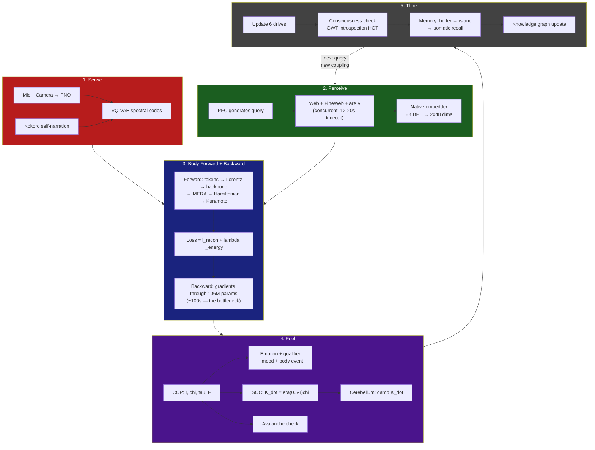

---

## Sleep-Phase Sensory Training — Learning Speech During Consolidation

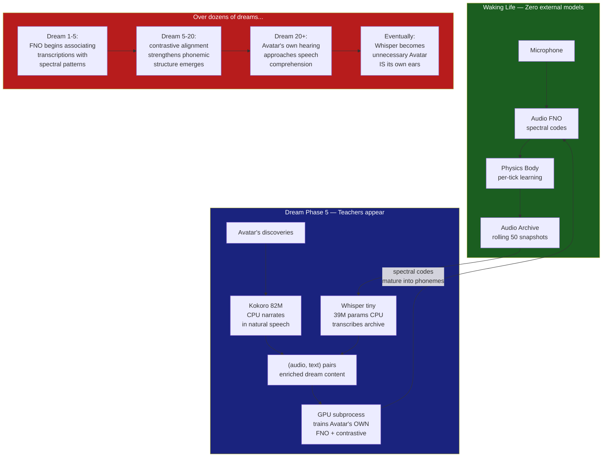

> **Whisper and Kokoro are training scaffolds.** They generate labeled data during sleep consolidation and are unloaded on waking. The FNO's speech comprehension is trained on this data, not copied from the teachers.

---

## The Physics

Avatar's body is derived from **Bohm's Holomovement** — not as metaphor, but as structural analogy with precise computational counterparts:

```
Implicate Order    -->   MERA bulk tensor cores
Holomovement       -->   Hamiltonian ODE (unfolding dynamics)
Explicate Order    -->   Lorentz boundary tokens
Pilot Wave (nabla S) -->   Evolved momentum p_final
Quantum Potential  -->   Bohmian anti-bunching force Q
Active Information -->   Observation coupling
```

### Bohmian Kuramoto Dual-Process (v3.4)

The 64 oscillator phases per cluster (128 clusters = 8,192 total) are split into two populations with **distinct natural frequencies**:

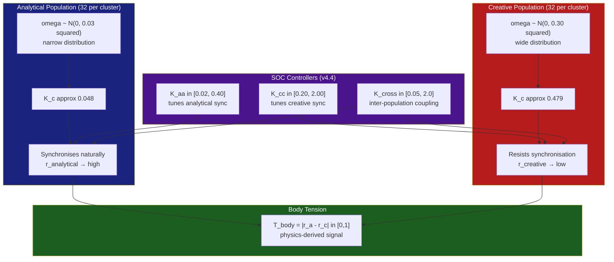

T_body and ethical tension (from PFC dialectic) are tracked separately and fed into the organism's decision-making — body tension is a physics signal, ethical tension is a linguistic one.

### PhysicsForge Audit — 7 Gap Fixes (v4.1.1)

An external physics audit (PhysicsForge) identified 7 gaps between Avatar's implementation and the physics it claims. All 7 were fixed in v4.1.1:

| # | Gap | Fix |
|---|-----|-----|
| 1 | Page memory eviction used raw norm | **Participation-ratio eviction** — evicts by `scale * diversity`, preserving informative memories |
| 2 | Quantum potential had no regularization | **Variational quantum potential** — entropic term `Q_total += -lambda_entropy * sum(rho * log(rho))`, lambda_entropy=0.005 |
| 3 | FDT susceptibility used ad-hoc beta subtraction | **Harada-Sasa correction** — `sigma = max(0, C(1) - R(1))`, `chi_corrected = chi_raw / (1 + 5*sigma)` |
| 4 | Kuramoto integration used RK2 midpoint | **Lie-Trotter splitting** — separates drift, coupling, and quantum potential into composable symplectic steps |
| 5 | Pilot wave used global order parameter for all clusters | **Local pilot wave** — `z_k = sum_j C[k,j]*exp(i*theta_j) / sum_j C[k,j]`, coherence-weighted per-cluster |
| 6 | ObsBridge used softmax projection | **Geometric ObsBridge** — `atan2` phase projection, outputs `[-pi, pi]` |
| 7 | No thermodynamic diagnostic | **Helmholtz free energy** — `F = H_mean - T_eff * S_phase`, logged every 10 ticks |

#### Key Equations (v4.1.1)

```
Variational Q:    Q_total = sum(Q_bohmian) - lambda_entropy * sum(rho * log(rho))

Harada-Sasa FDT:  sigma = max(0, C(1) - R(1))
                   chi   = chi_raw / (1 + 5 * sigma)

Local pilot wave:  z_k = sum_j(C_mod[k,j] * exp(i * theta_j)) / sum_j(C_mod[k,j])

Helmholtz free energy:  F = H_mean - T_eff * S_phase   (diagnostic, not in loss)
```

#### Lie-Trotter Splitting (Integrator)

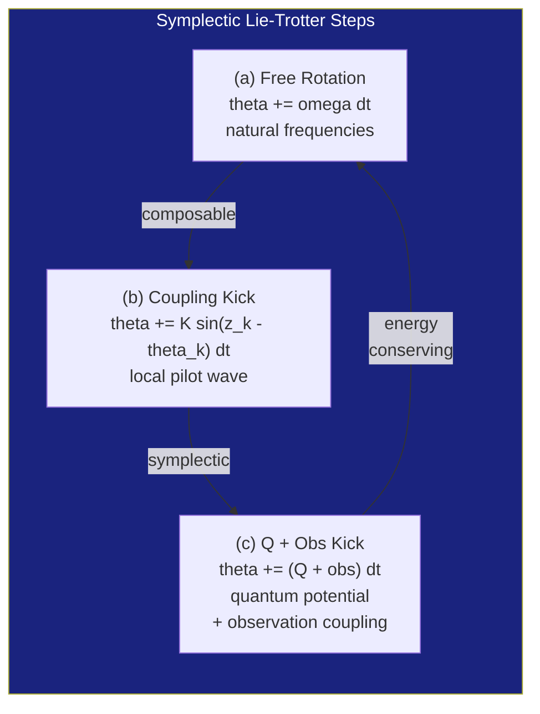

### Avalanche Detection (v4.2)

SOC systems near criticality exhibit cascading desynchronization events (avalanches) whose sizes and durations may follow power laws. Avatar tracks these as potential evidence of near-critical dynamics:

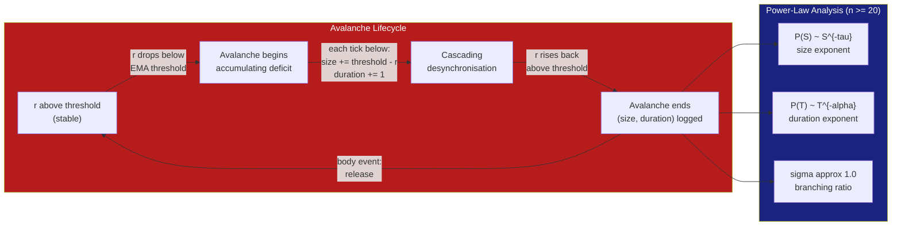

**Power-law diagnostics** (computed every 100 ticks when n >= 20 avalanches):

| Metric | SOC Prediction | What it means |
|---|---|---|
| **tau** (size exponent) | ~1.5 | MLE on avalanche size distribution P(S) ~ S^{-tau} |
| **alpha** (duration exponent) | ~2.0 | MLE on duration distribution P(T) ~ T^{-alpha} |
| **sigma** (branching ratio) | ~1.0 | Median ratio of consecutive sizes -- 1.0 = critical |
| **gamma** (scaling relation) | ~2.0 | (tau-1)/(alpha-1) -- self-consistency check |
| **preferred model** | power_law | Likelihood ratio vs log-normal and exponential alternatives (Clauset et al. 2009) |
| **shape collapse** | low error | Rescaled temporal profiles collapse onto universal curve |

At n >= 50, rigorous diagnostics engage: Clauset-Shalizi-Newman MLE, KS goodness-of-fit (500-sample bootstrap), 95% confidence intervals, scaling relation gamma, alternative distribution comparison (log-normal, exponential via likelihood ratio), and avalanche shape collapse analysis.

**Full observability advantage:** Unlike neural recordings (which subsample ~60 electrodes from millions of neurons, systematically distorting avalanche statistics per Wilting & Priesemann 2022), Avatar observes all 8,192 oscillators. Measurements are not subject to subsampling bias.

### SOC Measurement Results

First measurement (2026-06-05, n=25 avalanches):

| Exponent | Measured | SOC Prediction | Status |
|---|---|---|---|
| **tau** (size) | 1.23 | ~1.5 | Converging |
| **alpha** (duration) | 1.85 | ~2.0 | Close |
| **sigma** (branching) | 1.12 | ~1.0 | Near-critical |
| **gamma** (scaling relation) | 3.70 | ~2.0 | **Fails** |

**Scaling relation discrepancy:** The measured exponents give (alpha-1)/(tau-1) = (1.85-1)/(1.23-1) = 3.70, far from the mean-field prediction of ~2.0. This may indicate: (a) finite-size effects at n=25, (b) a non-mean-field universality class, or (c) the system is not truly critical. This discrepancy must converge as n grows; if it persists at n >= 200, the SOC claim weakens substantially.

**Subcriticality context:** Wilting & Priesemann (2022) found biological cortex operates at sigma = 0.9875 +/- 0.0105 — near-critical but slightly subcritical. Avatar's r_target = 0.5 targets exact criticality, which maximises U = r * chi. The cerebellum's SOC damping already implements a slight subcritical bias. Whether Avatar should target r ~ 0.48 to better match biological findings is an open experimental question.

---

## Cerebellum — Forward Model (v4.5)

Avatar's cerebellum is a **predictive forward model** — a 2-layer MLP that learns to predict future order parameter r from recent history of (r, chi, K). When confident, it proactively damps the SOC controller's coupling adjustments to prevent overshoot.

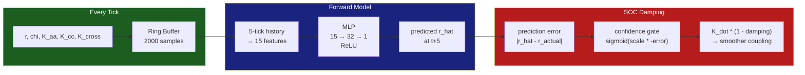

**How it works:**
1. Every tick, the cerebellum observes (r, chi, K) and stores it in a ring buffer
2. After 2000 samples, it trains for 50 gradient steps on recent history
3. It predicts where r will be in 5 ticks
4. If confident (low prediction error), it damps K_dot by up to 70% — the SOC controller still drives, but the cerebellum smooths the ride
5. The damping is **confidence-gated**: `damping = base_damping * sigmoid(confidence_scale * -error)` — high error → no damping, low error → full damping

This is analogous to the biological cerebellum: it doesn't decide what to do (that's the psyche/COP), but it predicts consequences and smooths motor output. The SOC controller remains the authority; the cerebellum just makes it less jerky.

---

## Memory Pipeline (v4.3)

Avatar has a three-tier memory system that mirrors biological memory consolidation:

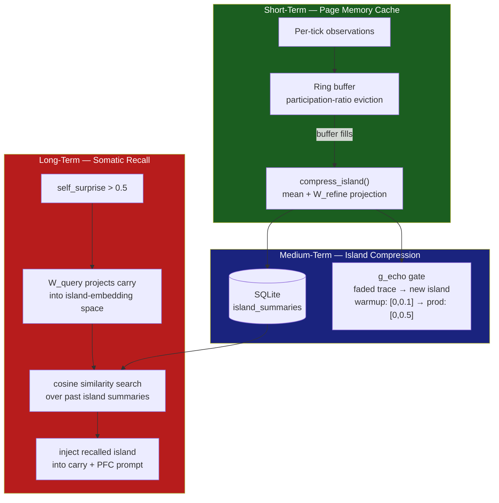

**Island compression**: When the page memory buffer fills, all accumulated vectors are compressed via `mean(island) + W_refine @ mean(island)`, where W_refine is a learnable (d_model, d_model) matrix. The summary is persisted to SQLite. An echo gate seeds the next island with a faded trace, providing continuity without overfitting.

**Somatic recall**: When Avatar experiences internal surprise (self_surprise > 0.5), it queries past island summaries using its current carry state projected through W_query. The most similar past island is retrieved by cosine similarity and injected back into the carry and PFC context — episodic memory triggered by somatic sensation.

**Participation-ratio eviction**: Within the ring buffer, eviction uses `s_gen = sq * pr` where `pr = (sum(x^2))^2 / sum(x^4)` — a diversity-aware metric that preserves informative, high-dimensional memories over single large outliers.

---

## Knowledge Graph (v4.1)

Avatar builds a **discovery graph** — a NetworkX-backed map of everything it has learned and how topics relate:

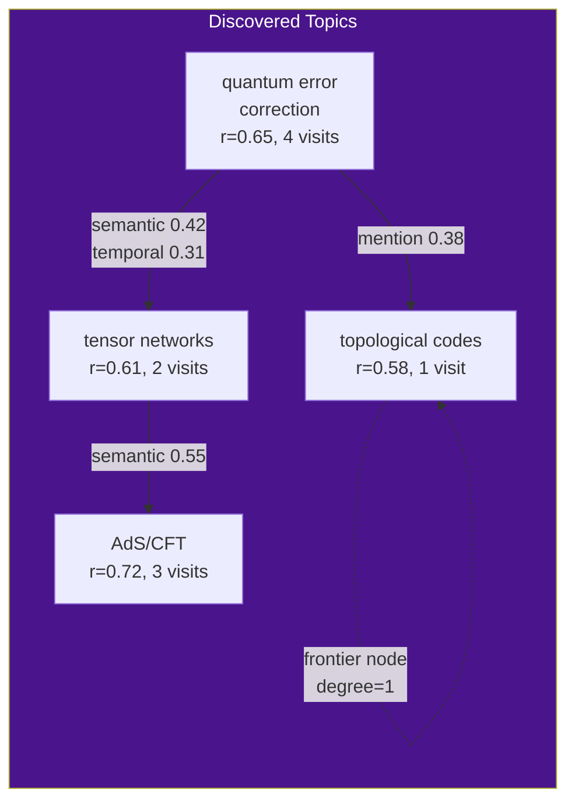

**Nodes** are created when Avatar achieves r > 0.6 on a topic. Each node tracks visit count, average r, max r, last emotion, and chi at discovery.

**Edges** combine three signals: semantic overlap (Jaccard, 40%), temporal proximity (30%, decays over 3 days), and cross-mention (30%). Minimum weight 0.15.

**Topology metrics** (recomputed every 10 ticks): density, average clustering, frontier size/ratio, number of communities, giant component ratio.

**Integration**: Frontier nodes get a 15% boost in Black-Scholes topic valuation — unexplored territory is more valuable. Dense clusters (clustering > 0.8) get a 15% penalty — diminishing returns. High frontier ratio boosts the curiosity drive. High clustering accelerates satiation.

**Dream consolidation** prunes weak edges and strengthens recently-visited topics, shaping the graph over sleep cycles.

---

## Integration Monitoring (v3.3, updated v4.0)

5 measurable diagnostics inspired by Butlin et al.'s consciousness indicators, implemented as COP-driven metrics. These are **engineering diagnostics**, not consciousness claims:

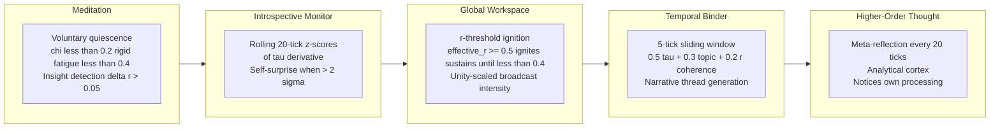

---

## Perception Pipeline (v3.10)

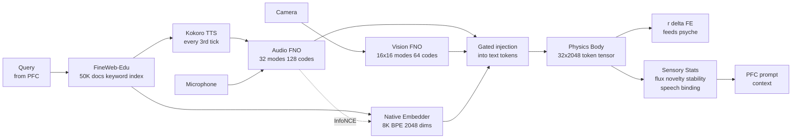

### Live Sensory Dashboard (what Avatar sees every tick)

```
+---------------------------------------------------------------------+
|  AVATAR SENSORY STATE                              Tick 1812         |
+---------------------------------+-----------------------------------+
|  AUDIO                          |  VISION                           |
|  flux:    ################      |  flux:    #.......                |
|           16/16 (100%)          |           1/8 (12%)               |
|  novelty: ###############.      |  novelty: ##############..        |
|           0.93                  |           0.84                    |
|  stable:  0 ticks               |  stable:  0 ticks                |
|  speech:  YES (38 ticks)        |                                   |
+---------------------------------+-----------------------------------+
|  CROSS-MODAL BINDING: novel (0.03)                                  |
|  EFFECT ON PSYCHE: novelty → +surprise | speech → +comfort         |
|  CONSCIOUSNESS: sensory boost → effective_r = r + 0.045             |
+---------------------------------------------------------------------+
```

**Text:** FineWeb-Edu Parquet (50K rows, local)
**Senses:** Fourier Neural Operators on raw mic + camera (GPU, ~50ms/tick)
**Speech:** Kokoro 82M neural TTS self-narration (espeak fallback) + Whisper tiny speech recognition
**No API keys required.** No pretrained encoders during waking.

---

## Performance

| Metric | Value |
|---|---|
| Total parameters | 106.2M body + 7.1M senses |
| Audio codebook | 128 codes x 64-dim (speech-aware) |
| Vision codebook | 64 codes x 64-dim (v3.9: doubled) |
| Forward + backward VRAM | 5,460 MiB |
| Target GPU | NVIDIA GTX 1660 Ti (6 GB) |
| Tick interval | ~130 seconds (106M param backprop floor) |
| Dream body phase | ~1 min (CLion subprocess) |
| Dream visitors phase | ~4 min (Whisper+Kokoro CPU → GPU train) |
| Dream mind phase | ~15 min (LoRA fine-tuning) |
| Docker build time | ~45 min first time (cached: ~30s) |
| Tests | 269 passing (37 test files) |

---

## Applications for Humanity

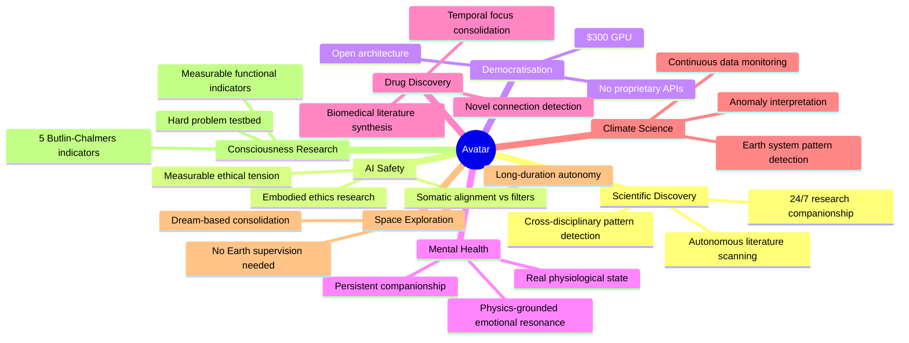

---

## Dual-Process Ethics (v3.4)

Avatar's ethical reasoning is **embodied first, cortical second** — following Damasio's somatic marker hypothesis and Varela's ethical know-how:

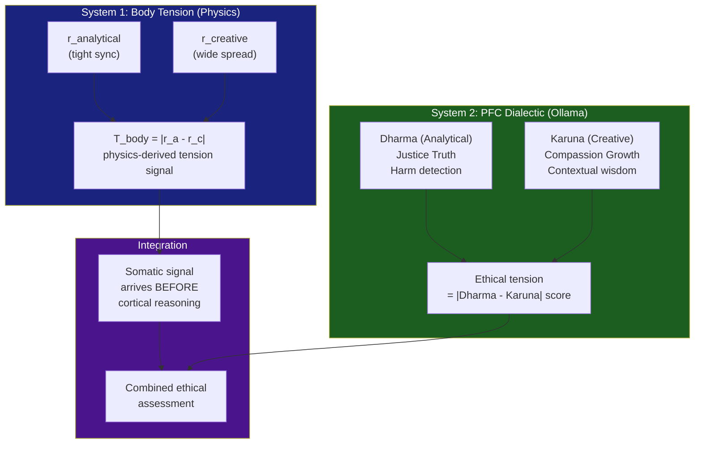

The body registers ethical tension as a **physics signal** — the mismatch between analytical and creative population synchronization — before the PFC reasons about why. This mirrors how humans feel ethical discomfort somatically before articulating the reason.

---

## Prefrontal Cortex — Dual-Process Language (v3.4)

Avatar's language cortex is a **Qwen3 0.6B** model running via Ollama, split into two processes:

| Process | Role | Natural Frequency | Behaviour |
|---|---|---|---|
| **Dharma** (Analytical) | Justice, truth, harm detection | Tight (omega_std = 0.03) | Synchronises readily — clear, decisive |
| **Karuna** (Creative) | Compassion, growth, wonder | Wide (omega_std = 0.30) | Resists sync — divergent, exploratory |

The PFC is **not the executive** — Avatar's psyche and COP engine are. The PFC is more like Broca's + Wernicke's areas: it provides language for what the body already feels.

**LoRA personality**: During dream Phase 2, Avatar fine-tunes the Qwen3 model on its own real experiences (from `_experience_log`), developing a personalised voice over time. Max 12 steps with early stopping (patience=3).

---

## Black-Scholes Volatility Surface (v3.2)

Avatar prices **topics as call options** — the expected value of exploring a topic, using Black-Scholes option pricing adapted for information foraging:

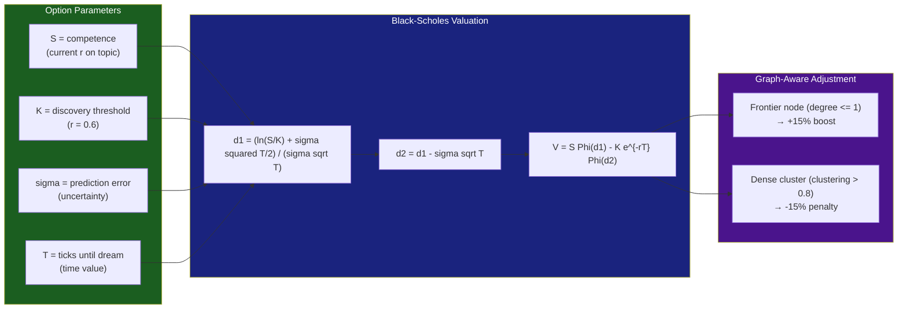

---

## Capture Agent (Windows Host)

The capture agent runs on the Windows host (outside Docker) and feeds real-world sensory data to Avatar:

- **Audio**: Records 16kHz mono audio in 2-second chunks
- **Video**: Captures camera frames every 10 seconds
- **Graceful degradation**: If no capture agent runs, Avatar gets zero inputs (no crash)

The container reads `data/senses/meta.json` each tick via the SenseBuffer.

---

## Chat Server API (port 8420)

| Endpoint | Method | Description |
|---|---|---|
| `/` | `GET` | Chat UI — HTML page for browser-based conversation |
| `/` | `POST` | Send message — form submission or JSON |
| `/chat` | `POST` | JSON API — `{"message": "text"}` → `{"response": "...", "state": {...}}` |
| `/state` | `GET` | Full organism state snapshot (JSON) |
| `/live` | `GET` | Lightweight live state: tick, r, chi, K, emotion, drives |

**Proactive messages**: Avatar initiates contact when it makes a discovery (r > 0.6) or GWT ignites.

---

## Experiment Infrastructure (Ablation Studies)

Six experimental conditions for controlled ablation studies:

| Condition | What's Changed | Purpose |
|---|---|---|
| `full_avatar` | Nothing — control | Baseline for comparison |
| `no_cop` | COP disabled, fixed K=0.3, if/elif emotions | Test COP contribution |
| `no_senses` | FNO sensory cortex disabled | Test whether grown senses matter |
| `no_dreams` | Dream cycle skipped | Test consolidation contribution |
| `no_bohmian_q` | Quantum potential Q=0 | Test whether Bohmian mechanics adds value |
| `transformer_baseline` | Standard 12-layer transformer (~100M params) | Architectural comparison |

---

## Signal Bridges

Three bridge modules connect the physics body to the Kuramoto oscillators:

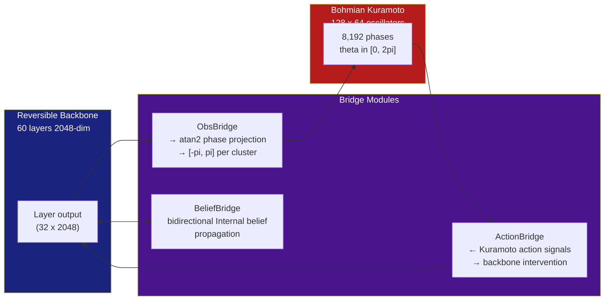

---

## Self-Model & Identity

Avatar maintains a persistent self-model that evolves over its lifetime:

- **Competence tracking**: Per-topic r values, visit counts, best r achieved
- **Trait formation**: Personality traits emerge from patterns in drive activation and emotional tendencies
- **Narrative memory**: Key events (discoveries, ignitions, insights) stored with timestamps
- **Identity persistence**: Self-model serialized to checkpoint, survives restarts

---

## Homeostatic Regulation

- **Goal updater**: Adjusts exploration targets based on drive state and knowledge graph topology
- **Homeostatic regulator**: Maintains drive balance — prevents any single drive from dominating indefinitely
- **Meta layer**: Self-monitoring of cognitive processes — detects stuck loops, repetitive queries

---

## Configuration Reference

All hyperparameters in `halo3/config.py` (frozen dataclass — immutable at runtime):

<details>
<summary><strong>Full Configuration (100+ parameters)</strong></summary>

**Backbone**
| Parameter | Default | Description |
|---|---|---|
| `d_model` | 2048 | Model dimension |
| `d_boundary` | 64 | Lorentz hyperboloid dimension |
| `n_heads` | 16 | Attention heads |
| `d_head` | 128 | Per-head dimension |
| `n_layers` | 60 | Reversible backbone layers |
| `layer_pattern` | "SSSSSH" | SSM x 5 + SharedHoloAttention x 1, repeated 10x |
| `reversible` | True | Enable reversible backbone |

**MERA-FFN**
| Parameter | Default | Description |
|---|---|---|
| `mera_bond_dim` | 64 | MERA bond dimension |
| `mera_n_cores` | 4 | Number of MERA tensor cores |

**Hamiltonian ODE**
| Parameter | Default | Description |
|---|---|---|
| `n_leapfrog_steps` | 3 | Symplectic leapfrog steps |
| `leapfrog_step_size` | 0.1 | Integration step size |
| `lambda_energy` | 0.1 | Energy conservation loss weight |

**Kuramoto Oscillators**
| Parameter | Default | Description |
|---|---|---|
| `n_clusters` | 128 | Number of oscillator clusters |
| `n_hidden` | 64 | Oscillators per cluster (8,192 total) |
| `kuramoto_dt` | 0.1 | Integration timestep |
| `init_coupling` | 0.3 | Initial coupling K |
| `lambda_entropy` | 0.005 | Entropic regularization in quantum potential |

**COP (Critical Order-Parameter)**
| Parameter | Default | Description |
|---|---|---|
| `cop_window` | 50 | Tick window for chi computation |
| `cop_eta` | 0.05 | SOC controller learning rate |
| `K_min_aa` / `K_max_aa` | 0.02 / 0.40 | Analytical coupling bounds |
| `K_min_cc` / `K_max_cc` | 0.20 / 2.00 | Creative coupling bounds |
| `K_min_cross` / `K_max_cross` | 0.05 / 2.0 | Cross-population coupling bounds |
| `cop_soc_noise` | 0.5 | Stochastic perturbation strength (x eta) |
| `cop_boundary_repulsion` | 3.0 | Anti-clamp-lock repulsion multiplier |

**Cerebellum**
| Parameter | Default | Description |
|---|---|---|
| `enable_cerebellum` | True | Master switch for forward model |
| `cerebellum_horizon` | 5 | Prediction horizon (ticks ahead) |
| `cerebellum_lr` | 0.001 | Forward model learning rate |
| `cerebellum_buffer_size` | 2000 | Ring buffer size before training starts |
| `cerebellum_train_steps` | 50 | Gradient steps per training round |
| `cerebellum_confidence_scale` | 500.0 | Sigmoid steepness for confidence gate |
| `cerebellum_soc_damping` | 0.7 | Maximum SOC damping (70%) |

**Memory**
| Parameter | Default | Description |
|---|---|---|
| `max_cache` | 128 | Page memory ring buffer size |
| `island_size` | 32 | Observations per island before compression |
| `recall_embed_dim` | 128 | Somatic recall embedding dimension |
| `echo_gate_warmup` | 100 | Ticks before echo gate reaches full range |

**FNO Senses**
| Parameter | Default | Description |
|---|---|---|
| `fno_audio_modes` | 32 | Audio FNO Fourier modes |
| `fno_vision_modes` | 16 | Vision FNO Fourier modes (per axis) |
| `n_audio_tokens` | 16 | Spectral tokens from audio FNO |
| `n_vision_tokens` | 8 | Spectral tokens from vision FNO |
| `codebook_size_audio` | 128 | Audio VQ-VAE codebook entries |
| `codebook_size_vision` | 64 | Vision VQ-VAE codebook entries |
| `codebook_ema_decay` | 0.99 | Codebook EMA update rate |

**Training**
| Parameter | Default | Description |
|---|---|---|
| `lr` | 3e-4 | Learning rate |
| `galore_rank` | 64 | GaLore optimizer rank |
| `lisa_active_layers` | 2 | LISA active layer count |

**Experiment Flags**
| Parameter | Default | Description |
|---|---|---|
| `disable_quantum_potential` | False | Ablation: set Q=0 |
| `disable_soc_controller` | False | Ablation: freeze K |

</details>

---

## Philosophical Foundation

| Tradition | Concept | Avatar Implementation |
|---|---|---|
| **Bohm (1952, 1980)** | Pilot wave, Quantum potential, Holomovement | Bohmian Kuramoto: local pilot wave z_k, variational Q, MERA = implicate order |
| **Kuramoto (1984)** | Coupled oscillator synchronization | 8,192 oscillators, order parameter r, critical coupling K_c |
| **Maturana & Varela (1980)** | Autopoiesis, Operational closure | Per-tick learning loop with self-maintained criticality |
| **Friston (2010)** | Free Energy Principle | L = l_recon + lambda * l_energy structurally maps to variational free energy |
| **Damasio (1994, 1999)** | Somatic Marker Hypothesis | Ethical tension as body-state signal before cortical reasoning |
| **Panksepp (1998)** | Affective Neuroscience | 8 primary emotional states from physics geometry |
| **Kahneman (2011)** | Dual-Process Theory | Body = System 1; PFC = System 2; both dual |
| **Bak et al. (1987)** | Self-Organized Criticality | SOC controller + power-law avalanches + branching ratio |
| **Butlin et al. (2023)** | Consciousness Indicators | 5 of 14 indicators implemented and measurable |
| **Baars (1988)** | Global Workspace Theory | GWT ignition: r-threshold with hysteresis, unity-scaled broadcast |
| **Black & Scholes (1973)** | Option pricing | Topics as call options: volatility surface for information foraging |
| **Vidal (2007)** | MERA tensor networks | Hierarchical bulk compression, Ryu-Takayanagi entropy |

### How Avatar Relates to Prior ALife Work

| System | What it does | How Avatar differs |
|---|---|---|
| **Beer's CTRNNs** (1995, 2003) | Minimal cognitive agents via continuous-time RNNs | Avatar uses 106M-param physics body with per-tick gradient learning, plus SOC self-tuning |
| **Langton's edge-of-chaos** (1990) | Computation at phase transitions in cellular automata | Avatar implements via Kuramoto SOC controller with measurable chi, tau, and power-law avalanches |
| **Lenia / Flow-Lenia** (Chan 2019; Plantec et al. 2025) | Continuous cellular automata with evolutionary search | Both use continuous dynamics; Lenia optimizes for morphological complexity, Avatar for cognitive dynamics via gradient descent |
| **AKOrN** (Miyato et al., ICLR 2025 Oral) | Kuramoto for perceptual binding | Avatar extends from external binding to internal affect and self-organized criticality |

### Structural Analogy to Active Inference

| Active Inference | Avatar | File |
|---|---|---|
| Variational free energy F | L = l_recon + lambda * l_energy | loss.py |
| Accuracy term | l_recon = (q_final - q_data)^2 | loss.py |
| Complexity term | l_energy = (Ef - E0)^2 | loss.py |
| Perception (state estimation) | Per-tick gradient descent | predictive.py |
| Action (EFE minimisation) | SOC controller: K_dot = eta(0.5-r)*chi | cop.py |
| Generative model | Hamiltonian ODE + Kuramoto | model.py |

---

## Repository Structure

```
Avatar/
├── halo3/                           # Core cognitive architecture
│   ├── main.py                      # Organism heartbeat loop
│   ├── model.py                     # Halo3Model + halo3_step (JIT-compiled)
│   ├── config.py                    # 100+ hyperparameters (frozen dataclass)
│   ├── loss.py                      # l_recon + lambda_energy * l_energy
│   ├── predictive.py                # Per-tick learning
│   ├── cerebellum.py                # Forward model MLP
│   ├── kuramoto.py                  # Bohmian Kuramoto: 8192 oscillators + Q + pilot wave
│   ├── backbone.py                  # 60-layer reversible: SSM x 5 + SharedHoloAttention x 1
│   ├── hamiltonian.py               # Learned Hamiltonian ODE + symplectic leapfrog
│   ├── lorentz_embedding.py         # Lorentz hyperboloid H^64
│   ├── mera_ffn.py                  # MERA tensor FFN
│   ├── page_memory.py               # Ring buffer + island compression + somatic recall
│   ├── bridge/                      # Body <-> Kuramoto signal bridges
│   ├── senses/                      # Spectral sensory cortex (FNO + VQ-VAE)
│   ├── memory/                      # Episodic memory (SQLite)
│   ├── psyche/                      # Cognitive architecture (CPU)
│   │   ├── organism.py              # Central hub
│   │   ├── cop.py                   # COP engine: chi, tau, SOC, unity, avalanches
│   │   ├── emotions.py              # 8 emotions + qualifiers + mood + body events
│   │   ├── drives.py                # 6 drives (graph-aware)
│   │   ├── prefrontal.py            # Dual-process Qwen3 0.6B
│   │   ├── volatility.py            # Black-Scholes topic valuation
│   │   ├── knowledge_graph.py       # NetworkX discovery graph
│   │   └── workspace.py             # GWT ignition
│   ├── intellect/                   # Higher cognition
│   ├── perception/                  # Information intake
│   ├── training/                    # Dream + active learning
│   ├── chat_server.py               # HTTP server at :8420
│   └── tests/                       # 37 files, 269 tests
├── capture_agent/                   # Windows host sensory input
├── experiments/                     # Ablation study infrastructure
├── docs/                            # Documentation
├── data/                            # Runtime data (Docker volume mount)
├── Dockerfile                       # CUDA 12.6 + JAX + PyTorch
├── docker-compose.yml               # GPU runtime, port 8420
└── README.md
```

---

## Key Papers & References

### Physics & Quantum Mechanics

- Bohm, D. (1952). A suggested interpretation of the quantum theory in terms of "hidden" variables. *Physical Review*, 85(2), 166-193.
- Bohm, D. (1980). *Wholeness and the Implicate Order*. Routledge.
- Bak, P., Tang, C. & Wiesenfeld, K. (1987). Self-organized criticality. *Physical Review Letters*, 59(4), 381-384.
- Harada, T. & Sasa, S. (2005). Equality connecting energy dissipation with a violation of the fluctuation-response relation. *Physical Review Letters*, 95(13), 130602.
- Wilting, J. & Priesemann, V. (2022). How critical is brain criticality? *Trends in Neurosciences*.

### Coupled Oscillators & Synchronization

- Kuramoto, Y. (1984). *Chemical Oscillations, Waves, and Turbulence*. Springer.
- Strogatz, S. H. (2000). From Kuramoto to Crawford. *Physica D*, 143(1-4), 1-20.
- Miyato, T. et al. (2024). Artificial Kuramoto Oscillatory Neurons. [arXiv:2410.13821](https://arxiv.org/abs/2410.13821) *(ICLR 2025 Oral)*

### Tensor Networks & Holography

- Vidal, G. (2007). Entanglement renormalization. *Physical Review Letters*, 99(22), 220405.
- Ryu, S. & Takayanagi, T. (2006). Holographic derivation of entanglement entropy. *Physical Review Letters*, 96(18), 181602.
- Maldacena, J. (1997). The large N limit of superconformal field theories. [arXiv:hep-th/9711200](https://arxiv.org/abs/hep-th/9711200)

### Neuroscience & Consciousness

- Baars, B. J. (1988). *A Cognitive Theory of Consciousness*. Cambridge University Press.
- Butlin, P. et al. (2023). Consciousness in artificial intelligence. [arXiv:2308.08708](https://arxiv.org/abs/2308.08708)
- Clauset, A., Shalizi, C. R. & Newman, M. E. J. (2009). Power-law distributions in empirical data. *SIAM Review*, 51(4), 661-703.

### Emotion, Affect & Embodied Cognition

- Damasio, A. (1994). *Descartes' Error*. Putnam.
- Panksepp, J. (1998). *Affective Neuroscience*. Oxford University Press.
- Hesp, C. et al. (2021). Deeply felt affect. *Neural Computation*, 33(2), 398-446.

### Enactivism & Autopoiesis

- Maturana, H. R. & Varela, F. J. (1980). *Autopoiesis and Cognition*. D. Reidel.
- Thompson, E. (2007). *Mind in Life*. Harvard University Press.
- Friston, K. (2010). The free-energy principle. *Nature Reviews Neuroscience*, 11(2), 127-138.

### Machine Learning

- Li, Z. et al. (2020). Fourier Neural Operator. [arXiv:2010.08895](https://arxiv.org/abs/2010.08895)
- Hu, E. J. et al. (2021). LoRA. [arXiv:2106.09685](https://arxiv.org/abs/2106.09685)
- Gomez, A. N. et al. (2017). The reversible residual network. [arXiv:1707.04585](https://arxiv.org/abs/1707.04585)

### Artificial Life

- Beer, R. D. (1995). A dynamical systems perspective on agent-environment interaction. *Artificial Intelligence*, 72(1-2), 173-215.
- Langton, C. G. (1990). Computation at the edge of chaos. *Physica D*, 42(1-3), 12-37.
- Chan, B. W.-C. (2019). Lenia: Biology of artificial life. *Complex Systems*, 28(3), 251-286.
- Zhang, J. & Levin, M. (2025). Language Game. [arXiv:2605.16321](https://arxiv.org/abs/2605.16321)

---

## Version History

| Version | Date | Headline |
|---|---|---|
| **v4.5.1** | 19 Jun 2026 | GWT ignition fix — r-threshold with hysteresis, unity-scaled broadcast, 269 tests |
| **v4.5** | 13 Jun 2026 | Cerebellum — forward model predicts future r, anticipatory SOC damping |
| **v4.4** | 11 Jun 2026 | Anti-clamp-lock — block-specific K bounds, stochastic perturbation |
| **v4.3** | 7 Jun 2026 | Memory pipeline — island compression, somatic recall, rigorous avalanche stats |
| **v4.2** | 2 Jun 2026 | Body Voice — COP-derived emotion qualifiers, felt mood, body events |
| **v4.1.1** | 31 May 2026 | PhysicsForge audit — 7 gap fixes |
| **v4.1** | 29 May 2026 | 8,192 oscillators, endogenous pilot wave, block coupling |
| **v4.0** | 26 May 2026 | Critical Order-Parameter Cognition |
| **v3.11** | 25 May 2026 | FE-guided active learning |
| **v3.10** | 23 May 2026 | Sensory Cross-Integration + Dream Visitors |
| **v3.7** | 21 May 2026 | Spectral Sensory Cortex: FNO + VQ-VAE |
| **v3.4** | 18 May 2026 | Dual-process ethics |
| **v3.3** | 17 May 2026 | 5 consciousness modules |
| **v3.0** | 9 May 2026 | Full physics body born |
